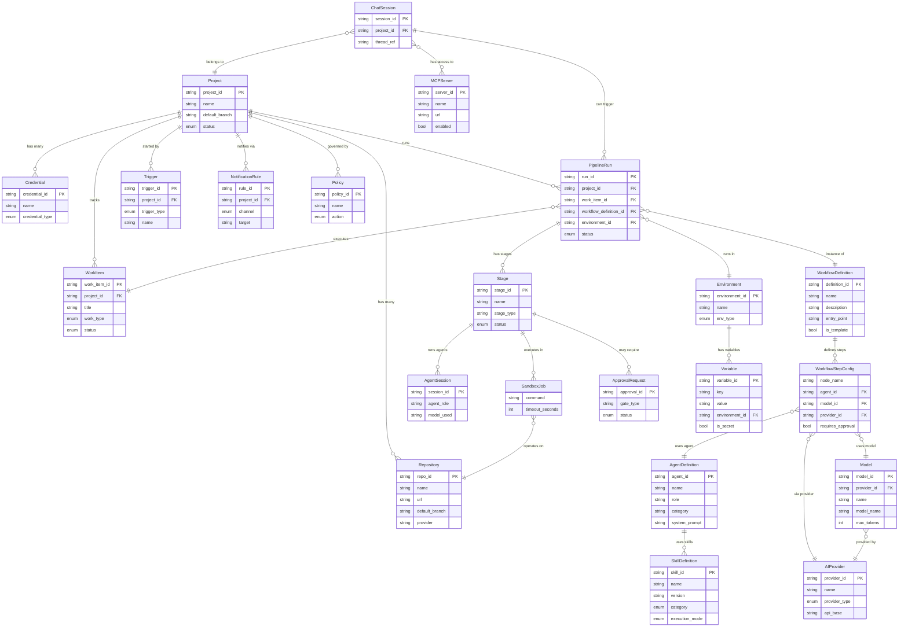

# Lintel

Open source AI collaboration infrastructure.

Lintel coordinates AI agents and human teams inside conversation threads. Teams interact through Slack, while agents plan, code, review, and execute work in isolated sandboxes. Every action is recorded in an append-only event store, giving you a complete audit trail.

## What it does

- **Multi-agent orchestration** -- Specialised agents (planner, coder, reviewer, PM, designer, summarizer) collaborate within a single thread
- **Slack-native** -- Conversations happen where your team already works
- **Sandboxed execution** -- Code runs in isolated containers, not on your infrastructure
- **PII protection** -- Messages are scanned and anonymised before reaching any model
- **Event-sourced** -- Every decision, model call, and approval is an immutable event
- **Human-in-the-loop** -- Agents propose; humans approve merges, deployments, and sensitive actions
- **Model-agnostic** -- Route to any LLM provider per agent role via policy

## Architecture

```
Slack  -->  Channel Adapter  -->  PII Pipeline  -->  Event Store
                                                         |
                                                    LangGraph Workflows
                                                    /        |        \
                                              Planner    Coder    Reviewer
                                                           |
                                                       Sandbox
                                                           |
                                                    Repo / PR
```

The system follows **event sourcing with CQRS**. Commands express intent and may fail. Events are past-tense facts that are never modified. Domain code depends on Protocol interfaces; infrastructure provides concrete implementations.

### Domain Model



Key abstractions live in `src/lintel/contracts/`:

| Module | Purpose |
|---|---|
| `types.py` | Core value objects (`ThreadRef`, enums, `ModelPolicy`) |
| `commands.py` | Imperative command schemas |
| `events.py` | Immutable event types with `EventEnvelope` wrapper |
| `protocols.py` | Service boundary interfaces (`EventStore`, `Deidentifier`, `ChannelAdapter`, `ModelRouter`, `SandboxManager`, `RepoProvider`, `SkillRegistry`) |

## Requirements

- Python 3.12+
- [uv](https://docs.astral.sh/uv/) package manager
- PostgreSQL (for the event store)
- NATS (for messaging)

## Getting started

```bash
# Install dependencies
make install

# Run the dev server
make serve

# Run all checks
make all
```

## Local development with Docker

```bash
# Copy and fill in environment variables
cp .env.example .env

# Start all services (Postgres, NATS, Lintel)
cd ops && docker compose up -d

# Verify
curl http://localhost:8000/healthz

# Stop
cd ops && docker compose down
```

## Available commands

Run `make help` to see all targets.

```
make install          Install all dependencies
make test             Run all tests
make test-unit        Run unit tests
make test-integration Run integration tests
make test-e2e         Run e2e tests
make lint             Check linting and formatting
make typecheck        Run mypy strict type checking
make format           Auto-fix formatting and lint
make serve            Start dev server on :8000
make migrate          Run event store migrations
make all              Run lint, typecheck, and tests
```

## Project layout

```
src/lintel/
  contracts/       Domain types, commands, events, protocol interfaces
  domain/          Domain logic
  agents/          Agent role definitions
  workflows/       LangGraph workflow graphs and nodes
  projections/     CQRS read-side projections
  skills/          Pluggable agent capabilities
  api/             FastAPI routes and middleware
  infrastructure/  Concrete implementations
    channels/      Slack adapter
    event_store/   PostgreSQL event persistence
    models/        LLM routing (litellm)
    pii/           PII detection and anonymisation (presidio)
    sandbox/       Isolated execution environments
    vault/         Encrypted secret storage
    repos/         Git and PR operations
    observability/ OpenTelemetry tracing
tests/
  unit/            Fast, no external dependencies
  integration/     Uses testcontainers (Postgres, NATS)
  e2e/             Full system tests
```

## License

[MIT](LICENSE)
