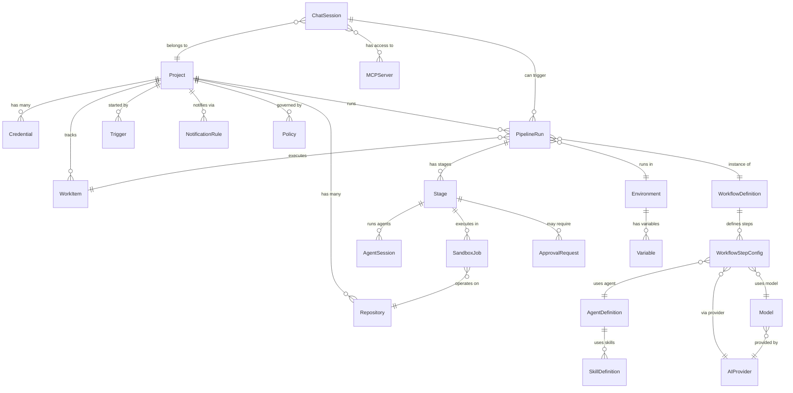

<p align="center">
  
  
  
  
  
</p>

# Lintel

**The AI-human engineering platform where agents and humans collaborate as teammates.**

Lintel doesn't just measure software delivery — it *executes* it. Teams interact through Slack or the web UI while specialised AI agents plan, code, review, and ship work in isolated sandboxes. Every action is recorded in an append-only event store, giving you a complete audit trail and DORA-grade metrics — all derived from the event stream, not bolted on.

> DX, LinearB, and Minware are mirrors — they show you what happened.
> Lintel is a flywheel — it measures, acts, and improves automatically.

---

## How it works

```
  +---------+     +---------+     +--------+     +--------+     +---------+     +-------+
  | DESIRE  | --> | DEVELOP | --> | REVIEW | --> | DEPLOY | --> | OBSERVE | --> | LEARN |
  +---------+     +---------+     +--------+     +--------+     +---------+     +-------+
       ^                                                                           |
       +----------------------- learnings inform next desire ----------------------+
```

You describe what you want in a Slack thread or chat. Lintel classifies the request, builds a work plan, writes the code, runs tests, requests reviews, and waits for your approval before merging. Each phase transition is an event. Each event feeds metrics. Metrics trigger guardrails. The flywheel turns.

### Pipeline stages

```
ingest → route → setup_workspace → research → approve_research
  → plan → approve_spec → implement → test → review → approve_merge → merge
```

Every stage is observable, retryable, and produces audit events. Approval gates pause the pipeline and wait for human sign-off.

---

## Key capabilities

| | |
|---|---|
| **Multi-agent orchestration** | Specialised agents (planner, coder, reviewer, PM, designer, summarizer) collaborate within a single workflow, each routable to different LLM providers |
| **Chat-driven workflows** | Describe work in natural language — Lintel classifies intent, creates work items, and dispatches the right pipeline |
| **Sandboxed execution** | Code runs in isolated Docker containers with `--cap-drop ALL`, seccomp profiles, read-only root filesystems, and no network after clone |
| **PII protection** | Messages are scanned with Presidio and anonymised before reaching any model |
| **Event-sourced audit trail** | Every decision, model call, approval, and state change is an immutable event with full correlation tracking |
| **Human-in-the-loop** | Agents propose; humans approve merges, deployments, and sensitive actions via configurable approval gates |
| **Model-agnostic routing** | Route any agent role to any provider (OpenAI, Anthropic, Bedrock, Ollama, Azure) with priority-based model assignment policies |
| **MCP integration** | All 170+ API endpoints are automatically exposed as MCP tools, plus a client for connecting to external MCP servers |
| **Web UI** | Full-featured dashboard with 27 feature modules — pipelines, chat, sandboxes, agents, models, audit logs, and more |

---

## Architecture

```
                          ┌─────────────────┐
                          │   Slack / Chat   │
                          └────────┬────────┘
                                   │
                          ┌────────▼────────┐
                          │  PII Pipeline   │
                          └────────┬────────┘
                                   │
              ┌────────────────────▼────────────────────┐
              │           Event Store (Postgres)         │
              │  append-only · correlation · causation   │
              └────────────────────┬────────────────────┘
                                   │
              ┌────────────────────▼────────────────────┐
              │         LangGraph Workflow Engine        │
              │                                          │
              │  ┌──────────┐ ┌────────┐ ┌──────────┐  │
              │  │ Planner  │ │ Coder  │ │ Reviewer │  │
              │  └────┬─────┘ └───┬────┘ └────┬─────┘  │
              │       │           │            │         │
              │       ▼           ▼            ▼         │
              │  ┌─────────────────────────────────┐    │
              │  │    Sandboxed Execution (Docker)  │    │
              │  └─────────────────────────────────┘    │
              └────────────────────┬────────────────────┘
                                   │
              ┌────────────────────▼────────────────────┐
              │      Projections · Metrics · Audit       │
              └─────────────────────────────────────────┘
```

The system follows **event sourcing with CQRS**. Commands express intent and may fail. Events are past-tense facts that are never modified. Domain code depends on Protocol interfaces; infrastructure provides concrete implementations.

<details>
<summary><strong>Domain model</strong> (click to expand)</summary>



</details>

### Clean architecture boundaries

```
src/lintel/
  contracts/       Pure domain — types, commands, events, Protocol interfaces (no I/O)
  domain/          Domain logic and event dispatching
  agents/          Agent role definitions (planner, coder, reviewer, PM, designer, summarizer)
  workflows/       LangGraph workflow graphs and node implementations
  projections/     CQRS read-side projections (audit, metrics)
  skills/          Pluggable agent capabilities
  api/             FastAPI routes, middleware, MCP surface
  infrastructure/  Concrete implementations of Protocol interfaces
    channels/        Slack adapter (slack-bolt)
    event_store/     PostgreSQL event persistence (asyncpg + SQLAlchemy async)
    models/          LLM provider routing (litellm)
    pii/             PII detection and anonymisation (Presidio)
    sandbox/         Isolated Docker execution environments
    vault/           Encrypted secret storage (cryptography)
    repos/           Git and PR operations
    mcp/             MCP tool client for external servers
    observability/   OpenTelemetry tracing
```

Domain code depends only on `contracts/` abstractions — never on infrastructure.

---

## Quick start

### Prerequisites

- Python 3.12+
- [uv](https://docs.astral.sh/uv/) package manager
- Docker (for sandboxes and local Postgres)

### Install and run

```bash
git clone https://github.com/bamdadd/lintel.git
cd lintel

# Install dependencies
make install

# Start dev server (in-memory stores, no external deps)
make serve

# Or with Postgres
make serve-db

# Open the UI
open http://localhost:8000
```

### Run checks

```bash
make all              # lint + typecheck + test (917 tests)
```

### Docker Compose (full stack)

```bash
cp .env.example .env  # fill in your API keys
cd ops && docker compose up -d

curl http://localhost:8000/healthz
```

---

## Available commands

```
make install          Install all dependencies (uv sync --all-extras)
make serve            Dev server on :8000 (in-memory)
make serve-db         Dev server on :8000 (PostgreSQL)
make test             Run all tests
make test-unit        Unit tests only
make test-integration Integration tests (testcontainers)
make test-e2e         End-to-end tests
make lint             Ruff check + format check
make typecheck        mypy strict mode
make format           Auto-fix formatting and lint
make migrate          Run event store migrations
make all              lint + typecheck + test
make dev              Launch tmux dev environment (3 windows)
```

---

## Tech stack

| Layer | Technology |
|---|---|
| API | FastAPI, Pydantic v2, uvicorn |
| Workflows | LangGraph, LangChain |
| LLM routing | litellm (OpenAI, Anthropic, Bedrock, Ollama, Azure) |
| Database | PostgreSQL, asyncpg, SQLAlchemy async |
| Messaging | NATS |
| PII | Presidio (analyzer + anonymizer) |
| Sandbox | Docker (isolated containers) |
| Secrets | cryptography (Fernet) |
| Observability | OpenTelemetry (SDK + OTLP exporter) |
| Slack | slack-bolt, slack-sdk |
| MCP | fastapi-mcp (auto-expose), custom tool client |
| UI | React, Vite, Mantine, TanStack Query |
| Testing | pytest, pytest-asyncio, testcontainers |
| Code quality | ruff, mypy (strict mode) |

---

## Documentation

- [Platform Vision](docs/vision.md) — mission, principles, and differentiation
- [Architecture](docs/architecture.md) — detailed system design
- [Events](docs/events.md) — event types and the event store
- [Local Development](docs/local-dev.md) — dev environment setup
- [Requirements](docs/requirements/) — delivery loop, entities, guardrails, metrics, integrations

---

## License

[MIT](LICENSE)
