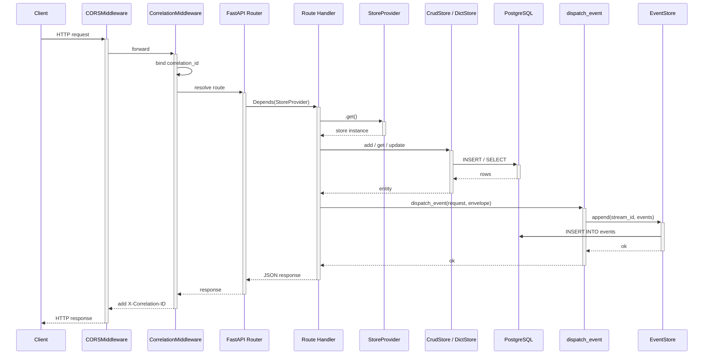
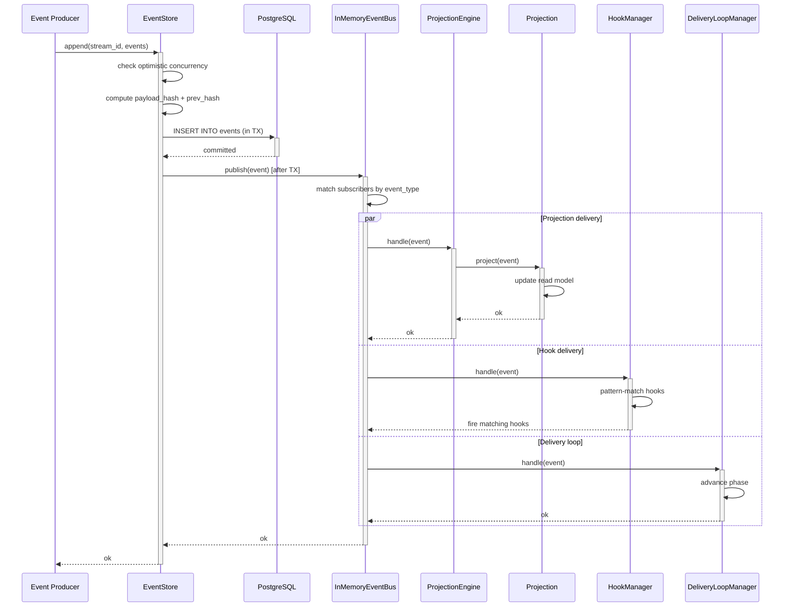
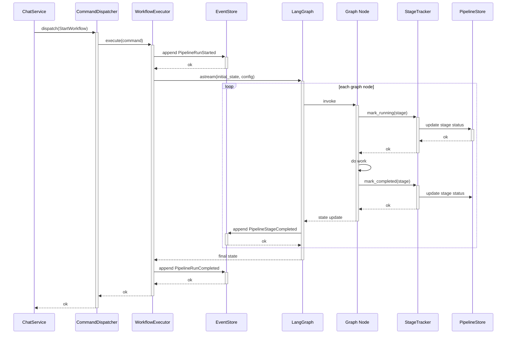
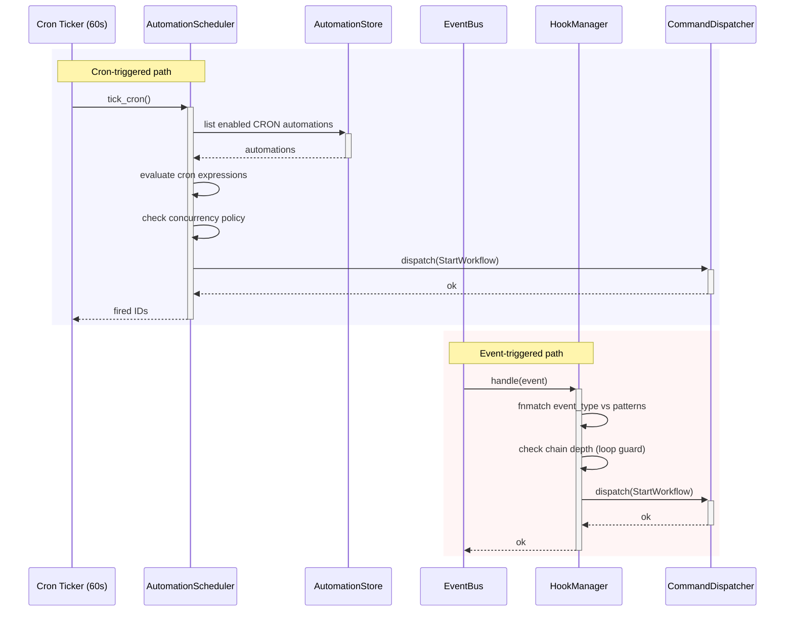
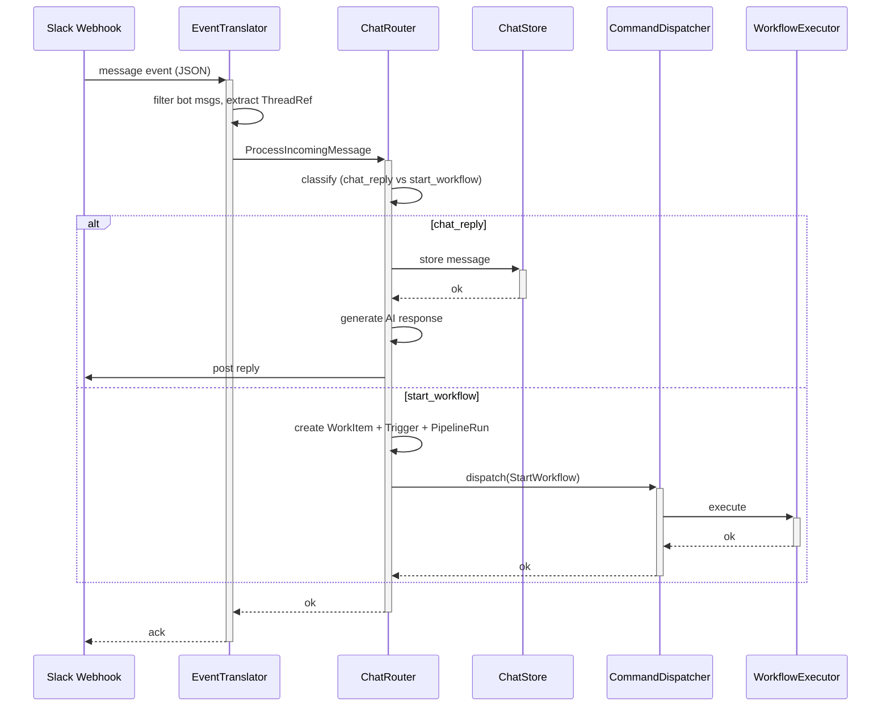
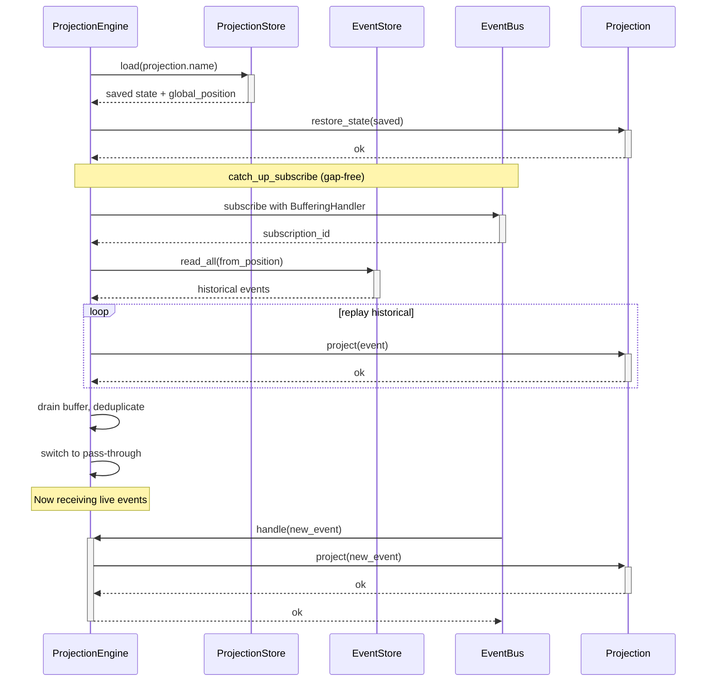
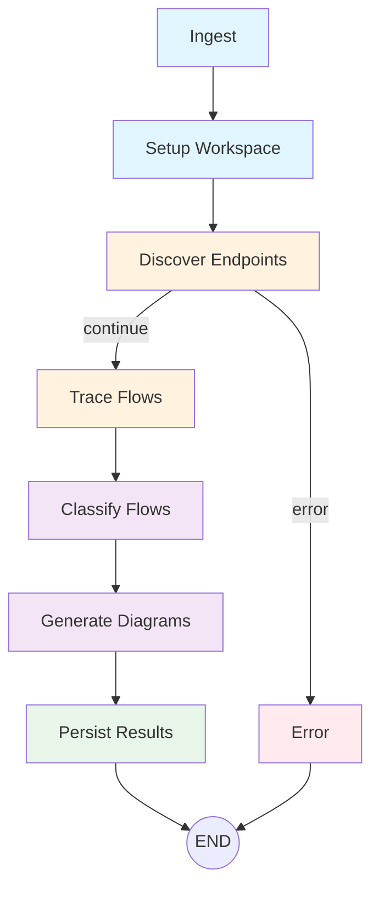

# Process Mining — Data Flow Diagrams

Reference diagrams showing how data flows through the Lintel platform.
Each diagram covers one flow type. The process mining workflow auto-generates
these per-repository; the diagrams below document the **platform itself**.

---

## 1. HTTP Request Flow

How a REST request arrives, passes through middleware, hits a route handler,
persists to a store, and optionally emits a domain event.

---

## 2. Event Sourcing Flow

How an event is created, persisted with hash-chain validation, published
to the in-memory event bus, and delivered to subscribers.

---

## 3. Command Dispatch Flow

How a command (e.g. `StartWorkflow`) is dispatched, handled by the executor,
and results in pipeline events.

---

## 4. Background Job / Automation Flow

How cron-scheduled and event-triggered automations fire workflows.

---

## 5. External Integration Flow (Slack / Telegram)

How external messages arrive, get translated to domain commands, and
trigger chat routing or workflow dispatch.

---

## 6. Projection Rebuild / Catch-up Flow

How projections restore state on startup and subscribe with gap-free delivery.

---

## 7. Process Mining Workflow

The workflow that auto-generates diagrams 1-6 for any target repository.

### What gets discovered

| Flow Type | Detection Method | Example |
|-----------|-----------------|---------|
| HTTP Request | `@router.get/post/put/delete` decorators | `POST /api/v1/users` |
| Event Sourcing | `event_bus.subscribe`, `@event_handler` | `WorkItemCreated -> AuditProjection` |
| Command Dispatch | `dispatcher.register` | `StartWorkflow -> WorkflowExecutor` |
| Background Job | `@celery_app.task`, `create_task`, cron patterns | `AutomationScheduler.tick_cron` |
| External Integration | `httpx`, `aiohttp`, `requests` calls | `SlackAdapter.post_message` |

### Other mining approaches to consider

- **AST-based import graph** — follow `import` statements to build module dependency trees
- **OpenTelemetry trace replay** — replay recorded spans to reconstruct real production flows
- **Database query log analysis** — parse `pg_stat_statements` to map which endpoints hit which tables
- **Git blame correlation** — map code paths to change frequency and ownership
- **Runtime instrumentation** — inject middleware that logs every function entry/exit during a test run
