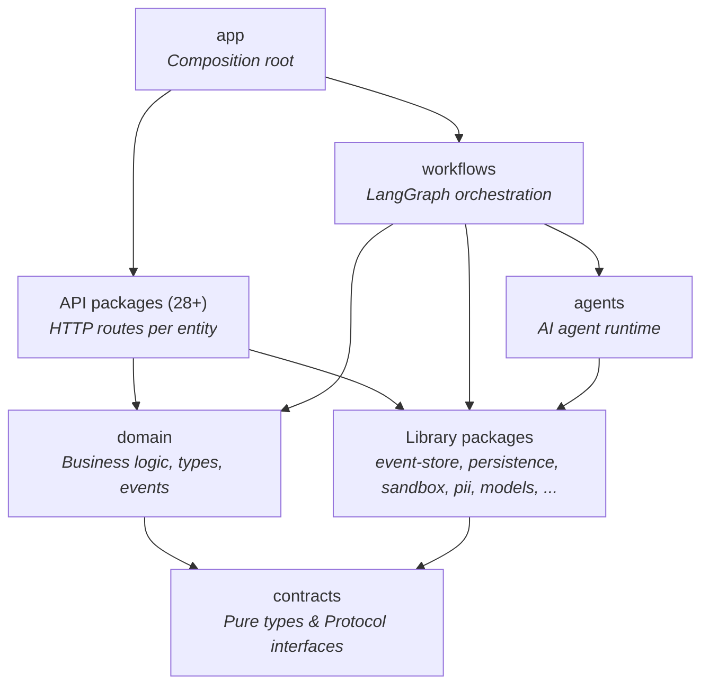

# Architecture

Lintel is an event-sourced CQRS platform built as a **uv workspace monorepo**. The codebase is split into independently installable packages organised in layers with strict dependency rules.

## Package layers



### Contracts (`packages/contracts/`)

Pure domain contracts: `ThreadRef`, `ActorType`, `EventEnvelope`, and Protocol interfaces (`EventStore`, `EventBus`, `CommandDispatcher`). This is the frozen kernel — no new types are added here.

### Domain (`packages/domain/`)

All domain types (Project, WorkItem, Board, User, Team, Policy, etc.), domain events, and sub-systems:

- **Metrics** — agent, DORA, human, and team metric collectors with a unified `MetricsEngine`
- **Hooks** — `HookEngine` for registering callbacks at workflow lifecycle points
- **Notifications** — multi-channel dispatcher (Slack, email, webhook)
- **Reviews** — automated codebase review orchestration
- **Guardrails** — condition language, `GuardrailEvaluator`, `ApprovalBridge`, cost rules, escalation
- **Auth** — JWT token creation/validation, password hashing
- **Git events** — `GitEventListener` for webhook-triggered workflows

### Agents (`packages/agents/`)

AI agent runtime with roles: planner, coder, reviewer, PM, designer, summarizer. Uses `litellm` for LLM provider routing and `lintel-sandbox` for isolated code execution.

### Workflows (`packages/workflows/`)

LangGraph workflow orchestration. Contains the `feature_to_pr` graph and individual workflow nodes (ingest, route, research, plan, implement, review, close). The `WorkflowNode` base class standardises stage tracking and error handling.

### Library packages

Reusable infrastructure, each independently installable:

| Package | Purpose |
|---------|---------|
| `event-store` | Append-only event persistence (Postgres + in-memory) |
| `event-bus` | In-memory pub/sub event bus |
| `projections` | Read-model projection engine |
| `persistence` | Generic CRUD/dict stores, vault |
| `sandbox` | Docker-based isolated code execution |
| `pii` | PII detection/anonymisation (presidio) |
| `observability` | OpenTelemetry tracing/metrics/logging |
| `models` | LLM provider routing (litellm) |
| `slack` | Slack channel adapter (slack-bolt) |
| `telegram` | Telegram channel adapter (aiogram) |
| `repos` | GitHub repository provider |
| `coordination` | Database advisory locks |
| `memory` | Vector memory store (Qdrant) |

### API packages (28+)

Each domain entity gets its own package with routes, request/response models, and an in-memory store. They follow the `StoreProvider` pattern from `lintel-api-support`:

```python
from lintel.api_support.provider import StoreProvider

user_store_provider: StoreProvider[UserStore] = StoreProvider()

@router.get("/users")
async def list_users() -> list[User]:
    store = user_store_provider.get()
    return await store.list()
```

The app wires real stores at startup via `.override()`.

### App (`packages/app/`)

Thin composition root. Handles lifespan wiring, middleware, and router mounting. No domain logic lives here.

## Event flow

```
User message (Slack / Chat API / Board)
  -> ChannelAdapter translates to canonical event
  -> Deidentifier scans and anonymises PII
  -> EventStore persists the event
  -> WorkflowEngine routes to LangGraph graph
  -> Agents execute steps (plan, code, review)
  -> SandboxManager runs code in isolation
  -> RepoProvider creates branches and PRs
  -> Human approves via approval gates
  -> EventStore records all decisions
```

## Key abstractions

| Protocol | Responsibility |
|----------|---------------|
| `EventStore` | Append-only event persistence |
| `EventBus` | Pub/sub event distribution |
| `Deidentifier` | PII detection and anonymisation |
| `PIIVault` | Encrypted PII placeholder storage |
| `ChannelAdapter` | Messaging channel abstraction |
| `ModelRouter` | LLM provider selection and invocation |
| `SandboxManager` | Isolated code execution containers |
| `RepoProvider` | Git and PR operations |

## Thread lifecycle

Each workflow instance is identified by a `ThreadRef(workspace_id, channel_id, thread_ts)`. The thread progresses through phases:

```
ingesting -> planning -> awaiting_spec_approval -> implementing ->
reviewing -> awaiting_merge_approval -> merging -> closed
```

## Security

- PII is detected and replaced with stable placeholders before reaching any LLM
- The PII vault encrypts raw values with Fernet; reveal requires human authorisation
- Sandbox containers run with `--cap-drop ALL`, seccomp profiles, read-only root filesystem, and no network access
- All actions are auditable through the event store
