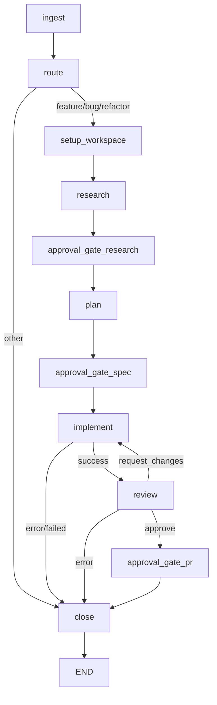

# Workflow Authoring

Lintel workflows are LangGraph state graphs that orchestrate multi-agent pipelines. This guide explains the built-in `feature_to_pr` workflow and how to extend it.

## Feature-to-PR pipeline

The primary workflow takes a work item and produces a pull request. It lives in `packages/workflows/src/lintel/workflows/feature_to_pr.py`.

### Stage flow



### Stages explained

| Stage | Node function | What it does |
|-------|--------------|--------------|
| **ingest** | `ingest_message` | Parses the work item description and extracts requirements |
| **route** | `route_intent` | Classifies intent as `feature`, `bug`, `refactor`, or other |
| **setup_workspace** | `setup_workspace` | Provisions a sandbox, clones the repository, creates a branch |
| **research** | `research_codebase` | Analyses the codebase to gather relevant context for planning |
| **approval_gate_research** | `approval_gate` | Pauses for human approval of the research findings |
| **plan** | `plan_work` | Generates an implementation plan based on research |
| **approval_gate_spec** | `approval_gate` | Pauses for human approval of the implementation spec |
| **implement** | `spawn_implementation` | Writes code in the sandbox, runs tests, iterates on failures |
| **review** | `review_output` | Automated code review; may request changes (up to 5 cycles) |
| **approval_gate_pr** | `approval_gate` | Pauses for human approval before finalising |
| **close** | `close_workflow` | Finalises the pipeline run and records completion events |

### Approval gates

Approval gates use LangGraph interrupts to pause execution. The graph is compiled with `interrupt_before` on the three gate nodes:

```python
graph.compile(
    checkpointer=checkpointer,
    interrupt_before=[
        "approval_gate_research",
        "approval_gate_spec",
        "approval_gate_pr",
    ],
)
```

When a pipeline reaches a gate, it pauses and waits for approval via the API:

```bash
# Approve a stage
curl -X POST http://localhost:8000/api/v1/pipelines/<RUN_ID>/stages/<STAGE_ID>/approve

# Reject a stage
curl -X POST http://localhost:8000/api/v1/pipelines/<RUN_ID>/stages/<STAGE_ID>/reject
```

### Review loop

After implementation, the review node evaluates the output. If the reviewer requests changes, the pipeline loops back to implement. This cycle repeats up to `MAX_REVIEW_CYCLES` (5) times. After that, the pipeline closes.

```
implement -> review -> request_changes -> implement -> review -> approve -> approval_gate_pr
```

## Writing a workflow node

All nodes follow a consistent pattern using `StageTracker` for lifecycle management.

### Function-based nodes

Most nodes are async functions that receive the workflow state and config:

```python
from lintel.workflows.nodes._stage_tracking import StageTracker

async def my_custom_node(
    state: ThreadWorkflowState,
    config: RunnableConfig,
) -> dict[str, Any]:
    tracker = StageTracker(config, state)
    await tracker.mark_running("my_stage")
    await tracker.append_log("my_stage", "Starting work...")

    # ... do the actual work ...

    await tracker.mark_completed("my_stage", outputs={"result": "done"})
    return {"current_phase": "next_phase"}
```

### Class-based nodes

For more complex nodes, extend `WorkflowNode`:

```python
from lintel.workflows.base import WorkflowNode

class MyNode(WorkflowNode):
    name: str = "my_stage"

    async def execute(
        self,
        state: ThreadWorkflowState,
        config: RunnableConfig,
    ) -> dict[str, Any]:
        await self.tracker.append_log(self.name, "Working...")
        return {"current_phase": "done"}

# Register in the graph:
graph.add_node("my_stage", MyNode())
```

`WorkflowNode` automatically handles `StageTracker` initialisation, `mark_running` / `mark_completed` lifecycle, and error handling.

## Adding a node to the graph

Register your node in the graph builder and wire it with edges:

```python
from lintel.workflows.feature_to_pr import build_feature_to_pr_graph

# Or build a custom graph:
from langgraph.graph import END, StateGraph
from lintel.workflows.state import ThreadWorkflowState

graph = StateGraph(ThreadWorkflowState)
graph.add_node("ingest", ingest_message)
graph.add_node("my_stage", my_custom_node)
graph.add_node("close", close_workflow)

graph.set_entry_point("ingest")
graph.add_edge("ingest", "my_stage")
graph.add_edge("my_stage", "close")
graph.add_edge("close", END)
```

### Conditional edges

Use conditional edges for branching logic:

```python
def decide_next(state: ThreadWorkflowState) -> str:
    if state.get("error"):
        return "close"
    return "continue"

graph.add_conditional_edges(
    "my_stage",
    decide_next,
    {"continue": "next_stage", "close": "close"},
)
```

## Key helpers

| Module | Class/Function | Purpose |
|--------|---------------|---------|
| `_stage_tracking` | `StageTracker` | Pipeline stage lifecycle (mark_running, append_log, mark_completed) |
| `_branch_naming` | `BranchNaming` | Branch name generation conventions |
| `_git_helpers` | `GitOperations` | Sandbox git operations (rebase, commit) |
| `_error_handling` | `WorkflowErrorHandler` | Standardised node error handling |
| `_event_helpers` | `AuditEmitter` | Audit entry recording |
| `_notifications` | `NotificationService` | Phase change notifications |
| `_quality_gates` | — | Quality gate evaluation |
| `_retry` | — | Retry logic for transient failures |

## Workflow state

The workflow state is a `TypedDict` (`ThreadWorkflowState`) that flows through all nodes. Key fields:

- `thread_ref` — the canonical workflow instance identifier
- `current_phase` — current lifecycle phase
- `intent` — classified intent (feature, bug, refactor)
- `agent_outputs` — list of outputs from each node
- `review_cycles` — number of review iterations completed
- `error` — error message if any node failed
