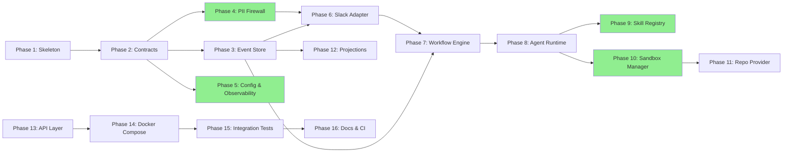

# Implementation Checklist

Track implementation progress by checking off completed items.

## Dependency Overview

**Parallel execution:** Phases 4+5 can run in parallel; Phases 9+10 can run in parallel; Phase 12 can start after Phase 3.

---

## Phase 1: Project Skeleton & Tooling

- [x] Step 1.1: Repository setup (pyproject.toml, uv, ruff, mypy)
- [x] Step 1.2: Source tree scaffold (src/lintel/ package structure)
- [x] Step 1.3: Taskfile.yaml (lint, typecheck, test, serve tasks)
- [x] Step 1.4: Pre-commit hooks
- [x] Validation: `task lint && task typecheck`

## Phase 2: Contracts & Domain Types

- [x] Step 2.1: Core value types (ThreadRef, ActorType, SkillDescriptor, etc.)
- [x] Step 2.2: Event envelope (DomainEvent base with schema_version)
- [x] Step 2.3: All event types (channel, workflow, agent, sandbox, repo, security)
- [x] Step 2.4: Command types
- [x] Step 2.5: Protocol interfaces (EventStore, PIIFirewall, ChannelAdapter, WorkflowEngine, etc.)
- [x] Validation: `task typecheck`

## Phase 3: Event Store

- [x] Step 3.1: Postgres event store implementation (asyncpg)
  - Blocked by: Phase 2
- [x] Step 3.2: SQL migrations (001_event_store.sql)
- [x] Step 3.3: Hash chaining for tamper evidence
- [x] Step 3.4: Idempotency enforcement
- [x] Step 3.5: Stream reads and correlation queries
- [x] Validation: `task test -- tests/unit/event_store/ && task test -- tests/integration/test_event_store.py`

## Phase 4: PII Firewall & Vault

- [x] Step 4.1: Presidio analyzer + anonymizer wrapper
  - Blocked by: Phase 2
- [x] Step 4.2: Stable per-thread placeholders
- [x] Step 4.3: Encrypted vault (Fernet) for PII mappings
- [x] Step 4.4: Fail-closed behavior (block above threshold)
- [x] Step 4.5: Custom recognizers (API keys, connection strings)
- [x] Step 4.6: PII events (PIIDetected, PIIAnonymised, PIIResidualRiskBlocked)
- [x] Validation: `task test -- tests/unit/infrastructure/test_pii_firewall.py`

## Phase 5: Configuration & Observability

- [ ] Step 5.1: Settings (pydantic-settings with env vars)
  - Blocked by: Phase 2
- [ ] Step 5.2: Structured logging (structlog with correlation_id)
- [ ] Step 5.3: OpenTelemetry tracing setup
- [ ] Step 5.4: Metrics (Prometheus-compatible)
- [ ] Validation: `task test -- tests/unit/infrastructure/test_config.py`

## Phase 6: Slack Channel Adapter

- [ ] Step 6.1: ChannelAdapter protocol implementation with Slack Bolt
  - Blocked by: Phases 3, 4
- [ ] Step 6.2: Inbound event translation (Slack -> canonical events)
- [ ] Step 6.3: Outbound message formatting (Block Kit)
- [ ] Step 6.4: Interactive components (approval buttons, reactions)
- [ ] Step 6.5: Thread context management
- [ ] Validation: `task test -- tests/unit/channels/`

## Phase 7: Workflow Engine (LangGraph)

- [ ] Step 7.1: LangGraph StateGraph wrapper behind Lintel abstractions
  - Blocked by: Phases 3, 6
- [ ] Step 7.2: Thread graph pattern (ingest -> route -> plan -> implement -> review -> close)
- [ ] Step 7.3: Postgres checkpointing
- [ ] Step 7.4: Human approval gates (interrupt_before)
- [ ] Step 7.5: Parallel agent spawning (Send API)
- [ ] Step 7.6: Workflow events (WorkflowStarted, WorkflowAdvanced, etc.)
- [ ] Validation: `task test -- tests/unit/workflows/`

## Phase 8: Agent Runtime & Model Router

- [ ] Step 8.1: Agent runtime with model policy enforcement
  - Blocked by: Phase 7
- [ ] Step 8.2: Model router with provider abstraction (litellm)
- [ ] Step 8.3: Tool allow-list per agent role
- [ ] Step 8.4: Agent events (AgentStepScheduled, ModelCallCompleted, etc.)
- [ ] Validation: `task test -- tests/unit/agents/`

## Phase 9: Skill Registry

- [ ] Step 9.1: Skill protocol & in-memory registry
  - Blocked by: Phase 8
- [ ] Step 9.2: Built-in skills (code, test, review)
- [ ] Step 9.3: Skill invocation events
- [ ] Validation: `task test -- tests/unit/skills/`

## Phase 10: Sandbox Manager

- [ ] Step 10.1: Sandbox protocol & Docker backend
  - Blocked by: Phase 8
- [ ] Step 10.2: Defense-in-depth security (cap-drop ALL, seccomp, read-only, no network)
- [ ] Step 10.3: Artifact collection (diffs, logs, test results)
- [ ] Step 10.4: Sandbox events
- [ ] Validation: `task test -- tests/unit/sandbox/`

## Phase 11: Repo Provider (GitHub)

- [ ] Step 11.1: RepoProvider protocol & GitHub implementation
  - Blocked by: Phase 10
- [ ] Step 11.2: Git operations (clone, branch, commit, push)
- [ ] Step 11.3: PR operations (create, comment)
- [ ] Step 11.4: Repo events
- [ ] Validation: `task test -- tests/unit/repo/`

## Phase 12: Projections & Read Models

- [ ] Step 12.1: Projection engine
  - Blocked by: Phase 3
- [ ] Step 12.2: Thread status projection
- [ ] Step 12.3: Task backlog projection
- [ ] Step 12.4: Projection SQL migrations
- [ ] Validation: `task test -- tests/unit/projections/`

## Phase 13: API Layer & FastAPI App

- [ ] Step 13.1: FastAPI app with lifespan, DI, correlation middleware
  - Blocked by: Phases 6-12
- [ ] Step 13.2: Health endpoint
- [ ] Step 13.3: Thread/event query endpoints
- [ ] Validation: `task test -- tests/integration/test_api.py`

## Phase 14: Docker Compose & Local Dev

- [ ] Step 14.1: Docker Compose (Postgres, NATS, Lintel)
  - Blocked by: Phase 13
- [ ] Step 14.2: Dockerfile
- [ ] Step 14.3: .env.example
- [ ] Validation: `docker compose up && curl localhost:8000/healthz`

## Phase 15: Integration Tests & E2E

- [ ] Step 15.1: Full message pipeline test
  - Blocked by: Phase 14
- [ ] Step 15.2: PII pipeline integration test
- [ ] Step 15.3: Workflow lifecycle integration test
- [ ] Validation: `task test-integration`

## Phase 16: Documentation & CI/CD

- [ ] Step 16.1: README, CONTRIBUTING, architecture docs
  - Blocked by: Phase 15
- [ ] Step 16.2: GitHub Actions CI (lint, typecheck, test-unit, test-integration)
- [ ] Validation: `task all`

---

## Final Verification

- [ ] `task lint` passes with zero warnings
- [ ] `task typecheck` passes with zero errors
- [ ] `task test-unit` passes (all green)
- [ ] `task test-integration` passes (Postgres + Docker)
- [ ] `docker compose up` starts successfully
- [ ] Health endpoint returns 200
- [ ] No Slack types leak outside `infrastructure/channels/slack/`
- [ ] No LangGraph imports outside `workflows/`
- [ ] No infrastructure imports inside `domain/` or `contracts/`
- [ ] CI passes
- [ ] PR ready for review

---

## Notes

[Space for implementation notes, blockers, decisions]
