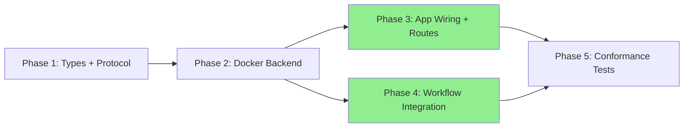

# Implementation Checklist

Track implementation progress by checking off completed items.

## Dependency Overview

**Parallel execution:** Phases 3 and 4 can run simultaneously after Phase 2 completes.

---

## Phase 1: Types + Protocol Consolidation

- [ ] Step 1.1: Create `src/lintel/contracts/errors.py` with SandboxError hierarchy
- [ ] Step 1.2: Extend `SandboxConfig` (network_enabled, timeout_seconds, environment) and `SandboxJob` (timeout_seconds) in `src/lintel/contracts/types.py`
- [ ] Step 1.3: Replace `SandboxManager` Protocol in `src/lintel/contracts/protocols.py` with 8-method version; remove `CommandResult`
- [ ] Step 1.3b: Delete `src/lintel/domain/sandbox/protocols.py`
- [ ] Validation: `make typecheck`

## Phase 2: Docker Backend

- [ ] Step 2.1: Create `src/lintel/infrastructure/sandbox/_tar_helpers.py`
  - Blocked by: Phase 1
- [ ] Step 2.2: Rewrite `src/lintel/infrastructure/sandbox/docker_backend.py` (demux, timeouts, file I/O, error handling, cached client, recover_orphans)
  - Blocked by: Step 2.1
- [ ] Validation: `make typecheck && make test-unit`

## Phase 3: App Wiring + Routes

- [ ] Step 3.1: Wire `DockerSandboxManager` into `src/lintel/api/app.py` lifespan
  - Blocked by: Phase 2
- [ ] Step 3.2: Rewrite `src/lintel/api/routes/sandboxes.py` to use `request.app.state.sandbox_manager`
  - Blocked by: Step 3.1
- [ ] Validation: `make test-unit`

## Phase 4: Workflow Integration

- [ ] Step 4.1: Add `sandbox_id: str | None` to `src/lintel/workflows/state.py`
  - Blocked by: Phase 2
- [ ] Step 4.2: Rewrite `src/lintel/workflows/nodes/implement.py` with real sandbox lifecycle
  - Blocked by: Step 4.1
- [ ] Validation: `make test-unit`

## Phase 5: Conformance Tests

- [ ] Step 5.1: Fix `tests/unit/contracts/test_protocols.py` conformance test
  - Blocked by: Phases 3+4
- [ ] Step 5.2: Create `DummySandboxManager` test fixture in `tests/fixtures/sandbox.py`
  - Blocked by: Phase 1
- [ ] Validation: `make all`

---

## Final Verification

- [ ] `make lint` passes
- [ ] `make typecheck` passes
- [ ] `make test` passes
- [ ] PR ready for review

---

## Notes

[Space for implementation notes, blockers, decisions]
