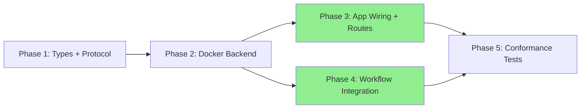

# Implementation Checklist

Track implementation progress by checking off completed items.

## Dependency Overview

**Parallel execution:** Phases 3 and 4 can run simultaneously after Phase 2 completes.

---

## Phase 1: Types + Protocol Consolidation

- [x] Step 1.1: Create `src/lintel/contracts/errors.py` with SandboxError hierarchy
- [x] Step 1.2: Extend `SandboxConfig` (network_enabled, timeout_seconds, environment) and `SandboxJob` (timeout_seconds) in `src/lintel/contracts/types.py`
- [x] Step 1.3: Replace `SandboxManager` Protocol in `src/lintel/contracts/protocols.py` with 8-method version; remove `CommandResult`
- [x] Step 1.3b: Delete `src/lintel/domain/sandbox/protocols.py`
- [x] Validation: `make typecheck`

## Phase 2: Docker Backend

- [x] Step 2.1: Create `src/lintel/infrastructure/sandbox/_tar_helpers.py`
- [x] Step 2.2: Rewrite `src/lintel/infrastructure/sandbox/docker_backend.py` (demux, timeouts, file I/O, error handling, cached client, recover_orphans)
- [x] Validation: `make typecheck && make test-unit`

## Phase 3: App Wiring + Routes

- [x] Step 3.1: Wire `DockerSandboxManager` into `src/lintel/api/app.py` lifespan
- [x] Step 3.2: Rewrite `src/lintel/api/routes/sandboxes.py` to use `request.app.state.sandbox_manager`
- [x] Validation: `make test-unit`

## Phase 4: Workflow Integration

- [x] Step 4.1: Add `sandbox_id: str | None` to `src/lintel/workflows/state.py`
- [x] Step 4.2: Rewrite `src/lintel/workflows/nodes/implement.py` with real sandbox lifecycle
- [x] Validation: `make test-unit`

## Phase 5: Conformance Tests

- [x] Step 5.1: Fix `tests/unit/contracts/test_protocols.py` conformance test
- [x] Step 5.2: DummySandboxManager created inline in test files
- [x] Validation: `make all`

---

## Final Verification

- [x] `make lint` passes
- [ ] `make typecheck` passes (pre-existing LangGraph type error in feature_to_pr.py:32)
- [x] `make test` passes (440 tests)
- [ ] PR ready for review

---

## Notes

- mypy has 1 pre-existing error: `spawn_implementation` signature incompatible with LangGraph's `add_node` due to `sandbox_manager` kwarg. This predates the sandbox abstraction work.
- Docker SDK returns `Any` types; suppressed ANN401 with `# noqa` on `_get_client` and `_get_container`.
