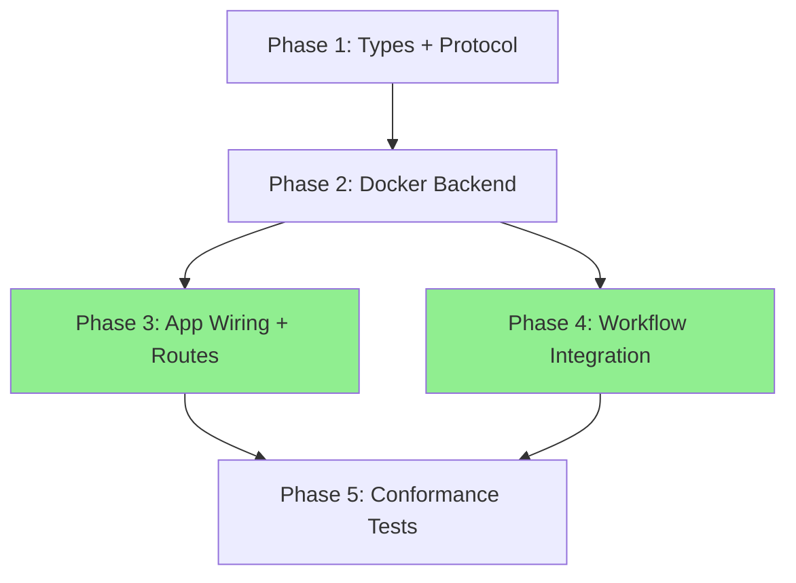

# Agent Sandbox Abstraction — Implementation Plan

**Selected Option:** B — Consolidate & Extend with Named Operations
**Confidence:** High (validated by 15+ production systems)

---

## Architecture Overview

```
┌─────────────────────────────────────────────────────────────────┐
│                        contracts/                                │
│  ┌──────────────┐  ┌──────────────┐  ┌────────────────────────┐ │
│  │  types.py     │  │  errors.py   │  │  protocols.py          │ │
│  │  SandboxConfig│  │  SandboxError│  │  SandboxManager(Proto) │ │
│  │  SandboxJob   │  │  NotFound    │  │    create()            │ │
│  │  SandboxResult│  │  Timeout     │  │    execute()           │ │
│  │  SandboxStatus│  │  Execution   │  │    read_file()         │ │
│  └──────────────┘  └──────────────┘  │    write_file()        │ │
│                                       │    list_files()        │ │
│                                       │    get_status()        │ │
│                                       │    collect_artifacts() │ │
│                                       │    destroy()           │ │
│                                       └────────────────────────┘ │
└──────────────────────────────┬──────────────────────────────────┘
                               │ depends on (Protocol)
         ┌─────────────────────┼──────────────────────┐
         ▼                     ▼                       ▼
┌─────────────────┐  ┌─────────────────┐  ┌──────────────────────┐
│ infrastructure/  │  │   api/           │  │   workflows/          │
│ sandbox/         │  │   app.py         │  │   state.py            │
│  docker_backend  │  │   routes/        │  │     sandbox_id: str?  │
│  _tar_helpers    │  │   sandboxes.py   │  │   nodes/              │
│                  │  │                  │  │     implement.py      │
│ (future: e2b,   │  │                  │  │                       │
│  modal, etc.)   │  │                  │  │                       │
└─────────────────┘  └─────────────────┘  └──────────────────────┘
```



**Parallel execution:** Phases 3 and 4 can run simultaneously after Phase 2.

---

## Phase 1: Types, Errors, Protocol Consolidation

No dependencies. Foundation for everything else.

### Step 1.1: Create Exception Hierarchy

**File:** `src/lintel/contracts/errors.py` (new)

```python
"""Domain exceptions for sandbox operations."""


class SandboxError(Exception):
    """Base for all sandbox errors."""


class SandboxNotFoundError(SandboxError):
    """Raised when a sandbox ID does not exist."""

    def __init__(self, sandbox_id: str) -> None:
        super().__init__(f"Sandbox not found: {sandbox_id}")
        self.sandbox_id = sandbox_id


class SandboxTimeoutError(SandboxError):
    """Raised when a sandbox operation exceeds its timeout."""


class SandboxExecutionError(SandboxError):
    """Raised when command execution fails unexpectedly."""
```

**Test strategy:** Unit test that exceptions can be raised and caught, and that `SandboxNotFoundError` exposes `sandbox_id`.

### Step 1.2: Extend Domain Types

**File:** `src/lintel/contracts/types.py`

Extend `SandboxConfig`:
```python
@dataclass(frozen=True)
class SandboxConfig:
    """Configuration for creating a sandbox container."""

    image: str = "python:3.12-slim"
    memory_limit: str = "512m"
    cpu_quota: int = 50000
    network_enabled: bool = False
    timeout_seconds: int = 3600
    environment: frozenset[tuple[str, str]] = frozenset()
```

Extend `SandboxJob`:
```python
@dataclass(frozen=True)
class SandboxJob:
    """A command to execute in a sandbox."""

    command: str
    workdir: str | None = None
    timeout_seconds: int = 300
```

**Test strategy:** Unit test that new fields have correct defaults, frozen immutability, and `frozenset` works for environment.

### Step 1.3: Consolidate SandboxManager Protocol

**File:** `src/lintel/contracts/protocols.py`

Remove `CommandResult` Protocol (lines 131-134). Replace `SandboxManager` Protocol (lines 137-164):

```python
class SandboxManager(Protocol):
    """Manages isolated sandbox environments for agent code execution."""

    async def create(
        self,
        config: SandboxConfig,
        thread_ref: ThreadRef,
    ) -> str: ...

    async def execute(
        self,
        sandbox_id: str,
        job: SandboxJob,
    ) -> SandboxResult: ...

    async def read_file(
        self,
        sandbox_id: str,
        path: str,
    ) -> str: ...

    async def write_file(
        self,
        sandbox_id: str,
        path: str,
        content: str,
    ) -> None: ...

    async def list_files(
        self,
        sandbox_id: str,
        path: str = "/workspace",
    ) -> list[str]: ...

    async def get_status(
        self,
        sandbox_id: str,
    ) -> SandboxStatus: ...

    async def collect_artifacts(
        self,
        sandbox_id: str,
    ) -> dict[str, Any]: ...

    async def destroy(
        self,
        sandbox_id: str,
    ) -> None: ...
```

Add imports for `SandboxConfig`, `SandboxJob`, `SandboxResult`, `SandboxStatus` in `TYPE_CHECKING` block.

**Delete:** `src/lintel/domain/sandbox/protocols.py`

**Test strategy:** mypy strict mode validates Protocol definition. Conformance test in Phase 5.

**Validation:** `make typecheck`

---

## Phase 2: Docker Backend Fix

Depends on Phase 1.

### Step 2.1: Create Tar Helpers

**File:** `src/lintel/infrastructure/sandbox/_tar_helpers.py` (new)

```python
"""Tar archive helpers for Docker container file I/O."""

from __future__ import annotations

import io
import os
import tarfile


def create_tar(file_path: str, content: str) -> io.BytesIO:
    """Create a tar archive containing a single file."""
    data = content.encode("utf-8")
    tar_stream = io.BytesIO()
    with tarfile.open(fileobj=tar_stream, mode="w") as tar:
        info = tarfile.TarInfo(name=os.path.basename(file_path))
        info.size = len(data)
        tar.addfile(info, io.BytesIO(data))
    tar_stream.seek(0)
    return tar_stream


def extract_file(archive_chunks: object) -> str:
    """Extract a single file's content from a Docker get_archive response."""
    stream = io.BytesIO(b"".join(archive_chunks))  # type: ignore[arg-type]
    with tarfile.open(fileobj=stream) as tar:
        member = tar.getmembers()[0]
        extracted = tar.extractfile(member)
        if extracted is None:
            msg = f"Cannot extract {member.name}: not a regular file"
            raise ValueError(msg)
        return extracted.read().decode("utf-8", errors="replace")


def extract_listing(archive_chunks: object) -> list[str]:
    """Extract file names from a tar archive (for directory listing)."""
    stream = io.BytesIO(b"".join(archive_chunks))  # type: ignore[arg-type]
    with tarfile.open(fileobj=stream) as tar:
        return [m.name for m in tar.getmembers()]
```

**Test strategy:** Unit test `create_tar` and `extract_file` round-trip with various content (empty, unicode, multiline).

### Step 2.2: Rewrite DockerSandboxManager

**File:** `src/lintel/infrastructure/sandbox/docker_backend.py`

Key changes:
- Method names match Protocol: `create`, `execute`, `destroy`, `read_file`, `write_file`, `list_files`, `get_status`, `collect_artifacts`
- `demux=True` on `exec_run` for separate stdout/stderr
- `asyncio.wait_for` wrapping `to_thread` for timeouts
- `SandboxNotFoundError` instead of bare `KeyError`
- Cached Docker client (lazy init)
- File I/O via tar helpers
- `get_status` via container inspect
- `recover_orphans()` for crash recovery via Docker labels
- `network_mode` respects `config.network_enabled`
- Environment variables from `config.environment`

```python
"""Docker-based sandbox backend with defense-in-depth security."""

from __future__ import annotations

import asyncio
import os
from typing import TYPE_CHECKING, Any
from uuid import uuid4

from lintel.contracts.errors import (
    SandboxExecutionError,
    SandboxNotFoundError,
    SandboxTimeoutError,
)

from ._tar_helpers import create_tar, extract_file

if TYPE_CHECKING:
    from lintel.contracts.types import (
        SandboxConfig,
        SandboxJob,
        SandboxResult,
        SandboxStatus,
        ThreadRef,
    )


class DockerSandboxManager:
    """Implements SandboxManager protocol using Docker containers."""

    def __init__(self) -> None:
        self._containers: dict[str, Any] = {}
        self._client: Any | None = None

    def _get_client(self) -> Any:
        if self._client is None:
            import docker  # type: ignore[import-untyped]

            self._client = docker.from_env()
        return self._client

    def _get_container(self, sandbox_id: str) -> Any:
        container = self._containers.get(sandbox_id)
        if container is None:
            raise SandboxNotFoundError(sandbox_id)
        return container

    async def create(
        self,
        config: SandboxConfig,
        thread_ref: ThreadRef,
    ) -> str:
        sandbox_id = str(uuid4())
        client = self._get_client()

        environment = dict(config.environment) if config.environment else {}

        container = await asyncio.to_thread(
            client.containers.create,
            image=config.image,
            command="sleep infinity",
            detach=True,
            cap_drop=["ALL"],
            security_opt=["no-new-privileges:true"],
            read_only=False,
            network_mode="bridge" if config.network_enabled else "none",
            mem_limit=config.memory_limit,
            cpu_period=100000,
            cpu_quota=config.cpu_quota,
            pids_limit=256,
            user="1000:1000",
            tmpfs={"/tmp": "size=100m,noexec"},
            environment=environment,
            labels={
                "lintel.sandbox_id": sandbox_id,
                "lintel.thread_ref": thread_ref.stream_id,
            },
        )
        await asyncio.to_thread(container.start)
        self._containers[sandbox_id] = container
        return sandbox_id

    async def execute(
        self,
        sandbox_id: str,
        job: SandboxJob,
    ) -> SandboxResult:
        from lintel.contracts.types import SandboxResult

        container = self._get_container(sandbox_id)

        async def _run() -> SandboxResult:
            exec_result = await asyncio.to_thread(
                container.exec_run,
                cmd=job.command,
                workdir=job.workdir or "/workspace",
                demux=True,
            )
            stdout_bytes, stderr_bytes = exec_result.output
            return SandboxResult(
                exit_code=exec_result.exit_code,
                stdout=(stdout_bytes or b"").decode("utf-8", errors="replace"),
                stderr=(stderr_bytes or b"").decode("utf-8", errors="replace"),
            )

        try:
            return await asyncio.wait_for(_run(), timeout=job.timeout_seconds)
        except TimeoutError as exc:
            raise SandboxTimeoutError(
                f"Command timed out after {job.timeout_seconds}s: {job.command}"
            ) from exc

    async def read_file(self, sandbox_id: str, path: str) -> str:
        container = self._get_container(sandbox_id)
        try:
            bits, _stat = await asyncio.to_thread(container.get_archive, path)
            return extract_file(bits)
        except Exception as exc:
            raise SandboxExecutionError(f"Failed to read {path}") from exc

    async def write_file(self, sandbox_id: str, path: str, content: str) -> None:
        container = self._get_container(sandbox_id)
        tar_stream = create_tar(path, content)
        dest_dir = os.path.dirname(path) or "/workspace"
        try:
            await asyncio.to_thread(container.put_archive, dest_dir, tar_stream)
        except Exception as exc:
            raise SandboxExecutionError(f"Failed to write {path}") from exc

    async def list_files(
        self, sandbox_id: str, path: str = "/workspace"
    ) -> list[str]:
        from lintel.contracts.types import SandboxJob

        result = await self.execute(
            sandbox_id, SandboxJob(command=f"ls -1 {path}", timeout_seconds=10)
        )
        if result.exit_code != 0:
            raise SandboxExecutionError(f"Failed to list {path}: {result.stderr}")
        return [f for f in result.stdout.strip().split("\n") if f]

    async def get_status(self, sandbox_id: str) -> SandboxStatus:
        from lintel.contracts.types import SandboxStatus

        container = self._get_container(sandbox_id)
        container_info = await asyncio.to_thread(container.reload)  # noqa: F841
        state = container.status
        status_map: dict[str, SandboxStatus] = {
            "created": SandboxStatus.CREATING,
            "running": SandboxStatus.RUNNING,
            "paused": SandboxStatus.RUNNING,
            "restarting": SandboxStatus.RUNNING,
            "removing": SandboxStatus.DESTROYED,
            "exited": SandboxStatus.COMPLETED,
            "dead": SandboxStatus.FAILED,
        }
        return status_map.get(state, SandboxStatus.FAILED)

    async def collect_artifacts(self, sandbox_id: str) -> dict[str, Any]:
        from lintel.contracts.types import SandboxJob

        result = await self.execute(
            sandbox_id, SandboxJob(command="git diff", workdir="/workspace")
        )
        return {"type": "diff", "content": result.stdout, "exit_code": result.exit_code}

    async def destroy(self, sandbox_id: str) -> None:
        container = self._containers.pop(sandbox_id, None)
        if container:
            await asyncio.to_thread(container.remove, force=True)

    async def recover_orphans(self) -> list[str]:
        """Discover and destroy orphaned containers from previous runs."""
        client = self._get_client()
        containers = await asyncio.to_thread(
            client.containers.list,
            filters={"label": "lintel.sandbox_id"},
            all=True,
        )
        destroyed = []
        for container in containers:
            sandbox_id = container.labels.get("lintel.sandbox_id", "")
            if sandbox_id and sandbox_id not in self._containers:
                await asyncio.to_thread(container.remove, force=True)
                destroyed.append(sandbox_id)
        return destroyed
```

**Test strategy:**
- Unit tests with mocked Docker client for all 8 methods
- Test `SandboxNotFoundError` raised for invalid IDs
- Test `SandboxTimeoutError` raised when timeout exceeded
- Test `demux=True` produces separate stdout/stderr
- Integration test (with real Docker) for create/execute/destroy lifecycle

**Validation:** `make typecheck && make test-unit`

---

## Phase 3: App Wiring & Routes

Depends on Phase 2. Parallel with Phase 4.

### Step 3.1: Wire SandboxManager in Lifespan

**File:** `src/lintel/api/app.py`

Add to lifespan function:
```python
from lintel.infrastructure.sandbox.docker_backend import DockerSandboxManager

# Inside lifespan():
sandbox_manager = DockerSandboxManager()
orphans = await sandbox_manager.recover_orphans()
if orphans:
    logger.info("Recovered %d orphaned sandbox containers", len(orphans))
app.state.sandbox_manager = sandbox_manager
```

### Step 3.2: Connect Sandbox Routes

**File:** `src/lintel/api/routes/sandboxes.py`

Replace in-memory dict with `request.app.state.sandbox_manager`:

```python
from lintel.contracts.errors import SandboxNotFoundError
from lintel.contracts.types import SandboxConfig, SandboxJob, ThreadRef

@router.post("/sandboxes")
async def create_sandbox(request: Request, body: CreateSandboxRequest) -> dict[str, str]:
    manager = request.app.state.sandbox_manager
    config = SandboxConfig(image=body.image)
    thread_ref = ThreadRef(
        workspace_id=body.workspace_id,
        channel_id=body.channel_id,
        thread_ts=body.thread_ts,
    )
    sandbox_id = await manager.create(config, thread_ref)
    return {"sandbox_id": sandbox_id}

@router.post("/sandboxes/{sandbox_id}/execute")
async def execute_command(
    request: Request, sandbox_id: str, body: ExecuteRequest
) -> dict[str, Any]:
    manager = request.app.state.sandbox_manager
    try:
        result = await manager.execute(sandbox_id, SandboxJob(command=body.command))
        return {"exit_code": result.exit_code, "stdout": result.stdout, "stderr": result.stderr}
    except SandboxNotFoundError:
        raise HTTPException(status_code=404, detail=f"Sandbox {sandbox_id} not found")

@router.delete("/sandboxes/{sandbox_id}")
async def destroy_sandbox(request: Request, sandbox_id: str) -> dict[str, str]:
    manager = request.app.state.sandbox_manager
    try:
        await manager.destroy(sandbox_id)
        return {"status": "destroyed"}
    except SandboxNotFoundError:
        raise HTTPException(status_code=404, detail=f"Sandbox {sandbox_id} not found")
```

**Test strategy:** Unit tests with `DummySandboxManager` injected via `app.state`. Test 404 for invalid sandbox IDs.

**Validation:** `make test-unit`

---

## Phase 4: Workflow Integration

Depends on Phase 2. Parallel with Phase 3.

### Step 4.1: Add sandbox_id to State

**File:** `src/lintel/workflows/state.py`

Add field to `ThreadWorkflowState`:
```python
sandbox_id: str | None
```

### Step 4.2: Implement Workflow Node

**File:** `src/lintel/workflows/nodes/implement.py`

Replace placeholder with real sandbox lifecycle:

```python
"""Implementation workflow node — creates sandbox and runs agent tools."""

from __future__ import annotations

import logging
from typing import TYPE_CHECKING, Any

if TYPE_CHECKING:
    from lintel.contracts.protocols import SandboxManager
    from lintel.contracts.types import SandboxConfig, SandboxJob, ThreadRef
    from lintel.workflows.state import ThreadWorkflowState

logger = logging.getLogger(__name__)


async def spawn_implementation(
    state: ThreadWorkflowState,
    *,
    sandbox_manager: SandboxManager,
    config: SandboxConfig | None = None,
) -> dict[str, Any]:
    """Create a sandbox, execute implementation, and collect artifacts."""
    from lintel.contracts.types import SandboxConfig, SandboxJob, ThreadRef

    if config is None:
        config = SandboxConfig()

    thread_ref = ThreadRef(
        workspace_id=state["workspace_id"],
        channel_id=state["channel_id"],
        thread_ts=state["thread_ts"],
    )

    sandbox_id = await sandbox_manager.create(config, thread_ref)
    try:
        # Clone repository into sandbox
        repo_url = state.get("repo_url", "")
        if repo_url:
            await sandbox_manager.execute(
                sandbox_id,
                SandboxJob(command=f"git clone {repo_url} /workspace", timeout_seconds=120),
            )

        # TODO: Wire agent tool loop here (ToolNode with sandbox tools)
        # For now, return sandbox_id so downstream nodes can use it

        artifacts = await sandbox_manager.collect_artifacts(sandbox_id)
        return {
            "sandbox_id": None,  # Clear after use
            "sandbox_results": [artifacts],
        }
    finally:
        await sandbox_manager.destroy(sandbox_id)
```

**Test strategy:** Unit test with `DummySandboxManager` verifying create/destroy lifecycle and artifact collection.

**Validation:** `make test-unit`

---

## Phase 5: Conformance Tests

Depends on Phases 3 and 4.

### Step 5.1: Fix Conformance Test

**File:** `tests/unit/contracts/test_protocols.py`

```python
"""Verify DockerSandboxManager satisfies SandboxManager Protocol."""

from __future__ import annotations

from typing import TYPE_CHECKING

if TYPE_CHECKING:
    from lintel.contracts.protocols import SandboxManager


def test_docker_sandbox_manager_satisfies_protocol() -> None:
    from lintel.infrastructure.sandbox.docker_backend import DockerSandboxManager

    manager: SandboxManager = DockerSandboxManager()  # type: ignore[assignment]
    assert manager is not None
```

Also create a `DummySandboxManager` test fixture:

**File:** `tests/conftest.py` or `tests/fixtures/sandbox.py`

```python
from __future__ import annotations

from typing import Any
from uuid import uuid4

from lintel.contracts.errors import SandboxNotFoundError
from lintel.contracts.types import (
    SandboxConfig,
    SandboxJob,
    SandboxResult,
    SandboxStatus,
    ThreadRef,
)


class DummySandboxManager:
    """In-memory sandbox manager for unit tests."""

    def __init__(self) -> None:
        self._sandboxes: dict[str, dict[str, str]] = {}

    async def create(self, config: SandboxConfig, thread_ref: ThreadRef) -> str:
        sandbox_id = str(uuid4())
        self._sandboxes[sandbox_id] = {}
        return sandbox_id

    async def execute(self, sandbox_id: str, job: SandboxJob) -> SandboxResult:
        if sandbox_id not in self._sandboxes:
            raise SandboxNotFoundError(sandbox_id)
        return SandboxResult(exit_code=0, stdout="ok\n")

    async def read_file(self, sandbox_id: str, path: str) -> str:
        if sandbox_id not in self._sandboxes:
            raise SandboxNotFoundError(sandbox_id)
        return self._sandboxes[sandbox_id].get(path, "")

    async def write_file(self, sandbox_id: str, path: str, content: str) -> None:
        if sandbox_id not in self._sandboxes:
            raise SandboxNotFoundError(sandbox_id)
        self._sandboxes[sandbox_id][path] = content

    async def list_files(self, sandbox_id: str, path: str = "/workspace") -> list[str]:
        if sandbox_id not in self._sandboxes:
            raise SandboxNotFoundError(sandbox_id)
        return [k for k in self._sandboxes[sandbox_id] if k.startswith(path)]

    async def get_status(self, sandbox_id: str) -> SandboxStatus:
        if sandbox_id not in self._sandboxes:
            raise SandboxNotFoundError(sandbox_id)
        return SandboxStatus.RUNNING

    async def collect_artifacts(self, sandbox_id: str) -> dict[str, Any]:
        if sandbox_id not in self._sandboxes:
            raise SandboxNotFoundError(sandbox_id)
        return {"type": "diff", "content": ""}

    async def destroy(self, sandbox_id: str) -> None:
        self._sandboxes.pop(sandbox_id, None)
```

**Test strategy:**
- `DummySandboxManager` also satisfies Protocol (conformance test)
- Use `DummySandboxManager` in all unit tests for routes and workflow nodes

**Validation:** `make all` (lint + typecheck + test)

---

## Files Changed Summary

| Phase | File | Action |
|-------|------|--------|
| 1 | `src/lintel/contracts/errors.py` | Create |
| 1 | `src/lintel/contracts/types.py` | Edit |
| 1 | `src/lintel/contracts/protocols.py` | Edit |
| 1 | `src/lintel/domain/sandbox/protocols.py` | Delete |
| 2 | `src/lintel/infrastructure/sandbox/_tar_helpers.py` | Create |
| 2 | `src/lintel/infrastructure/sandbox/docker_backend.py` | Rewrite |
| 3 | `src/lintel/api/app.py` | Edit |
| 3 | `src/lintel/api/routes/sandboxes.py` | Rewrite |
| 4 | `src/lintel/workflows/state.py` | Edit |
| 4 | `src/lintel/workflows/nodes/implement.py` | Rewrite |
| 5 | `tests/unit/contracts/test_protocols.py` | Rewrite |
| 5 | `tests/fixtures/sandbox.py` | Create |

---

## Final Validation

```bash
make all    # lint + typecheck + test
```

All 8 Protocol methods must:
1. Pass mypy strict mode
2. Be implemented by `DockerSandboxManager`
3. Be implemented by `DummySandboxManager`
4. Have unit test coverage
