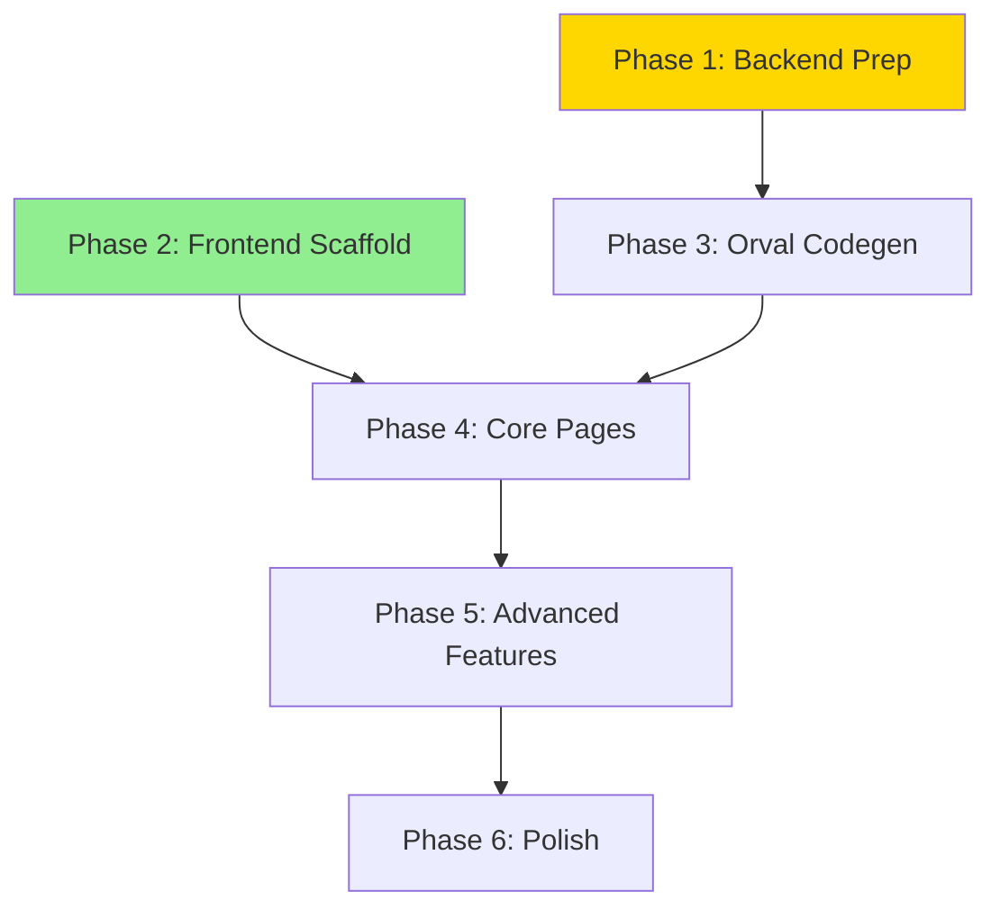

# Implementation Checklist

Track implementation progress by checking off completed items.

## Dependency Overview

**Parallel execution:** Phases 1 and 2 can run simultaneously.

---

## Phase 1: Backend Prep

- [x] Step 1.1: Add CORSMiddleware to `app.py` with `generate_unique_id_function`
- [x] Step 1.2a: Response models batch 1 — health, settings, metrics
- [x] Step 1.2b: Response models batch 2 — threads, workflows, events
- [x] Step 1.2c: Response models batch 3 — repositories, credentials, agents, skills
- [x] Step 1.2d: Response models batch 4 — sandboxes, pii, workflow_definitions
- [x] Step 1.2e: Response models batch 5 — projects, work_items, pipelines, environments
- [x] Step 1.2f: Response models batch 6 — users, teams, policies, notifications, audit
- [x] Step 1.2g: Response models batch 7 — triggers, variables, ai_providers, artifacts, approval_requests, chat
- [x] Step 1.3: Create `scripts/export_openapi.py` and verify spec output
- [x] Validation: `make typecheck && make test-unit` passes; `/openapi.json` has typed schemas

## Phase 2: Frontend Scaffold

- [x] Step 2.1: `bun create vite ui --template react-ts`
- [x] Step 2.2: Install all dependencies (Mantine, TanStack Query, React Flow, etc.)
- [x] Step 2.3: Configure Vite (proxy, build output, manual chunks)
- [x] Step 2.4: Configure TypeScript (strict, paths)
- [x] Step 2.5: Mantine Provider + theme + dark mode
- [x] Step 2.6: TanStack Query client config
- [x] Step 2.7: AppShell layout with sidebar navigation
- [x] Step 2.8: React Router with lazy-loaded routes
- [x] Step 2.9: Shared components (EmptyState, StatusBadge)
- [x] Validation: `bun run dev` shows app with sidebar and dark mode toggle

## Phase 3: Orval Codegen

- [x] Step 3.1: Configure `orval.config.ts`
  - Blocked by: Phase 1
- [x] Step 3.2: Create API client mutator (X-Correlation-ID, error handling)
- [x] Step 3.3: Run `bun run generate:api` and verify output
- [x] Step 3.4: Add generation script to `package.json`
- [x] Validation: `src/generated/` contains typed hooks; TypeScript compiles

## Phase 4: Core Pages

- [x] Step 4.1: Dashboard page (stats cards, recent threads, event feed)
  - Blocked by: Phases 2 + 3
- [x] Step 4.2: Threads list + detail (timeline, phase stepper, approval actions)
- [x] Step 4.3: Settings page + Setup Wizard (Stepper, connection test buttons)
- [x] Step 4.4: Repositories CRUD (list, create modal, edit, delete)
- [x] Step 4.5: Agents & Model Policies (role cards, policy forms, test prompt)
- [x] Step 4.6: Events Explorer (filterable table, expandable rows, correlation view)
- [x] Validation: All core pages render with empty states and populated data

## Phase 5: Advanced Features

- [x] Step 5.1: Workflow Editor (React Flow canvas, custom nodes, drag-and-drop, save/load)
  - Blocked by: Phase 4
- [x] Step 5.2: Command Palette (Mantine Spotlight, Cmd+K)
- [x] Step 5.3: Real-time event polling (conditional refetchInterval)
- [x] Step 5.4a: CRUD pages — Projects, Work Items, Pipeline Runs
- [x] Step 5.4b: CRUD pages — Environments, Variables, Triggers
- [x] Step 5.4c: CRUD pages — Users, Teams, Policies
- [x] Step 5.4d: CRUD pages — Notifications, Audit, AI Providers
- [x] Step 5.4e: CRUD pages — Artifacts, Approval Requests, Chat
- [x] Validation: Workflow editor saves/loads; Cmd+K works; all domain pages functional

## Phase 6: Polish

- [x] Step 6.1: Route-level error boundaries
  - Blocked by: Phase 5
- [x] Step 6.2: Empty states on all list pages
- [x] Step 6.3: Connection status indicator in header
- [x] Step 6.4: Testing (Vitest + RTL unit tests, MSW integration tests)
- [x] Step 6.5: Production build + FastAPI StaticFiles serving
- [x] Step 6.6: Makefile targets (ui-install, ui-dev, ui-build, ui-generate, ui-test)
- [x] Validation: `make ui-build && make serve` serves SPA from FastAPI

---

## Final Verification

- [x] All backend tests pass (`make test-unit`)
- [x] All frontend tests pass (`make ui-test`)
- [x] TypeScript compiles (`cd ui && bunx tsc --noEmit`)
- [x] Backend lint/typecheck passes (`make lint && make typecheck`)
- [x] Production build works (`make ui-build`)
- [x] PR ready for review

---

## Notes

[Space for implementation notes, blockers, decisions]
