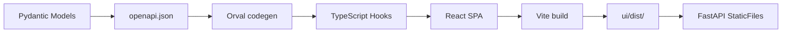
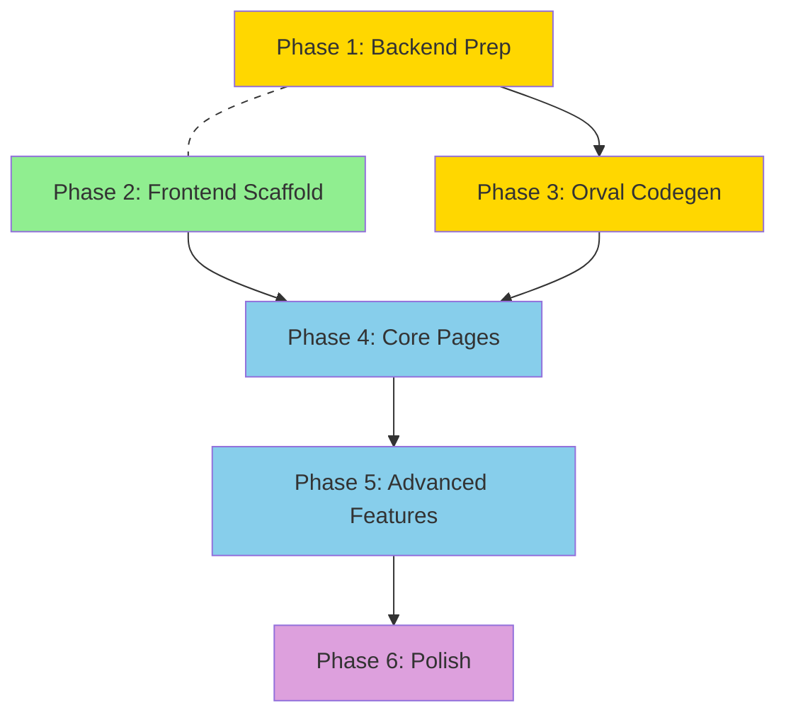

# Create a UI - Implementation Plan

**Selected Option:** A — Orval-Generated TypeScript Client with Feature-Based SPA
**Tech Areas:** python-api, react-ui
**Package Manager:** bun

---

## Architecture Overview

### System Architecture (ASCII)

```
+------------------+       +------------------+       +------------------+
|                  |       |                  |       |                  |
|   React SPA      | HTTP  |   FastAPI         |  SQL  |   PostgreSQL     |
|   (Vite dev)     +------>+   /api/v1/*       +------>+   Event Store    |
|   :5173          |       |   :8000           |       |                  |
|                  |       |                  |       +------------------+
+------------------+       +------------------+
        |                          |
        |  Orval codegen           |  OpenAPI 3.1
        +<-------------------------+  /openapi.json
                                   |
                              Pydantic v2
                              Response Models
```

### Build Pipeline (Mermaid)



### Frontend Architecture (ASCII)

```
ui/src/
+-- app/                        # App shell, routing, providers
|   +-- App.tsx                 # MantineProvider + QueryClientProvider + RouterProvider
|   +-- routes.tsx              # createBrowserRouter with lazy imports
|   +-- queryClient.ts          # TanStack Query client config
|   +-- theme.ts                # Mantine theme customisation
|
+-- features/                   # One folder per domain
|   +-- dashboard/
|   +-- threads/
|   +-- workflows/
|   +-- repositories/
|   +-- agents/
|   +-- skills/
|   +-- sandboxes/
|   +-- events/
|   +-- security/
|   +-- settings/
|   +-- projects/
|   +-- work-items/
|   +-- pipelines/
|   +-- environments/
|   +-- users/
|   +-- teams/
|   +-- policies/
|   +-- audit/
|   +-- notifications/
|   +-- triggers/
|   +-- variables/
|   +-- ai-providers/
|   +-- artifacts/
|   +-- approval-requests/
|   +-- chat/
|   Each feature contains:
|       +-- components/         # Presentational components
|       +-- pages/              # Route-level container components
|       +-- index.ts            # Public barrel export
|
+-- shared/
|   +-- components/             # EmptyState, StatusBadge, ContextHelp, CommandPalette
|   +-- hooks/                  # useDebounce, usePagination
|   +-- api/                    # apiClient base (X-Correlation-ID, error handling)
|   +-- types/                  # Branded types, shared enums
|   +-- layout/                 # AppShell, Header, Sidebar, ConnectionStatus
|
+-- generated/                  # Orval output (gitignored or committed)
|   +-- api/                    # One file per endpoint tag
|
+-- main.tsx                    # Entry point
```

### State Management

```
Server state (API data):       TanStack Query (via Orval-generated hooks)
URL state (filters, tabs):     useSearchParams
Ephemeral UI state:            useState / useReducer
Global UI state:               React context (sidebar, color scheme)
Workflow editor state:          Zustand (React Flow nodes/edges)
```

---

## Phase 1: Backend Prep

Unblock the frontend by adding CORS, response models, and clean OpenAPI operation IDs.

### Step 1.1: Add CORS Middleware

**File:** `src/lintel/api/app.py`

```python
from fastapi.middleware.cors import CORSMiddleware

def create_app() -> FastAPI:
    app = FastAPI(
        title="Lintel",
        version="0.1.0",
        lifespan=lifespan,
        generate_unique_id_function=lambda route: f"{route.tags[0]}_{route.name}" if route.tags else route.name,
    )
    app.add_middleware(CorrelationMiddleware)
    app.add_middleware(
        CORSMiddleware,
        allow_origins=["http://localhost:5173"],
        allow_methods=["*"],
        allow_headers=["*", "X-Correlation-ID"],
        expose_headers=["X-Correlation-ID"],
    )
    # ... routers
```

**Test:** `uv run pytest tests/unit/api/ -v -k cors` — verify OPTIONS preflight returns 200 with correct headers.

### Step 1.2: Add Pydantic Response Models (batch approach)

Create response models that wrap existing frozen dataclasses using `ConfigDict(from_attributes=True)`.

**File:** `src/lintel/api/schemas/` (new directory, one module per domain)

```python
# src/lintel/api/schemas/repositories.py
from pydantic import BaseModel, ConfigDict

class RepositoryResponse(BaseModel):
    model_config = ConfigDict(from_attributes=True)
    repo_id: str
    name: str
    url: str
    default_branch: str
    owner: str
    provider: str
    status: str

class RepositoryListResponse(BaseModel):
    repositories: list[RepositoryResponse]
```

Then annotate endpoints:

```python
# src/lintel/api/routes/repositories.py
@router.get("/repositories", response_model=RepositoryListResponse)
async def list_repositories(request: Request) -> RepositoryListResponse:
    ...
```

**Batch order** (by UI priority):
1. `health`, `settings`, `metrics` — needed by dashboard + setup wizard
2. `threads`, `workflows`, `events` — core pages
3. `repositories`, `credentials`, `agents`, `skills` — CRUD pages
4. `sandboxes`, `pii`, `workflow_definitions` — feature pages
5. `projects`, `work_items`, `pipelines`, `environments` — new domain pages
6. `users`, `teams`, `policies`, `notifications`, `audit` — admin pages
7. `triggers`, `variables`, `ai_providers`, `artifacts`, `approval_requests`, `chat` — remaining

Each batch: create schema module, annotate endpoints, run `make typecheck` and `make test-unit`.

**Test:** `make typecheck && make test-unit` after each batch. Verify `/openapi.json` contains typed schemas.

### Step 1.3: Export OpenAPI Script

**File:** `scripts/export_openapi.py`

```python
"""Export OpenAPI spec without starting the server."""
import json
from pathlib import Path
from lintel.api.app import create_app

app = create_app()
spec = app.openapi()
Path("openapi.json").write_text(json.dumps(spec, indent=2))
print(f"Exported {len(spec['paths'])} paths to openapi.json")
```

**Test:** `uv run python scripts/export_openapi.py && python -c "import json; d=json.load(open('openapi.json')); print(len(d['paths']), 'paths')"` — should show ~136 paths with typed schemas.

---

## Phase 2: Frontend Scaffold

Can start in parallel with Phase 1 (use Vite proxy to avoid CORS dependency).

### Step 2.1: Initialize Vite + React + TypeScript with bun

```bash
cd /Users/bamdad/projects/lintel
bun create vite ui --template react-ts
cd ui
bun install
```

### Step 2.2: Install Dependencies

```bash
cd ui
bun add @mantine/core @mantine/hooks @mantine/form @mantine/notifications \
       @mantine/spotlight @mantine/charts @mantine/dates \
       @tanstack/react-query @tanstack/react-query-devtools \
       react-router reactflow dagre @dagrejs/dagre \
       zod mantine-form-zod-resolver \
       @tabler/icons-react recharts
bun add -d orval @types/dagre msw @testing-library/react \
       @testing-library/jest-dom vitest jsdom
```

### Step 2.3: Configure Vite

**File:** `ui/vite.config.ts`

```typescript
import { defineConfig } from 'vite';
import react from '@vitejs/plugin-react';

export default defineConfig({
  plugins: [react()],
  server: {
    port: 5173,
    proxy: {
      '/api': { target: 'http://localhost:8000', changeOrigin: true },
      '/healthz': { target: 'http://localhost:8000', changeOrigin: true },
    },
  },
  build: {
    outDir: '../src/lintel/api/static',
    emptyOutDir: true,
    rollupOptions: {
      output: {
        manualChunks: {
          vendor: ['react', 'react-dom', 'react-router'],
          mantine: ['@mantine/core', '@mantine/hooks', '@mantine/form'],
          tanstack: ['@tanstack/react-query'],
          reactflow: ['reactflow'],
        },
      },
    },
  },
});
```

### Step 2.4: Configure TypeScript

**File:** `ui/tsconfig.json`

```json
{
  "compilerOptions": {
    "target": "ES2022",
    "lib": ["ES2022", "DOM", "DOM.Iterable"],
    "module": "ESNext",
    "moduleResolution": "bundler",
    "strict": true,
    "noUncheckedIndexedAccess": true,
    "jsx": "react-jsx",
    "baseUrl": ".",
    "paths": {
      "@/*": ["src/*"]
    }
  },
  "include": ["src"]
}
```

### Step 2.5: Mantine Provider + Theme + Dark Mode

**File:** `ui/src/app/theme.ts`

```typescript
import { createTheme } from '@mantine/core';

export const theme = createTheme({
  primaryColor: 'indigo',
  defaultRadius: 'md',
  fontFamily: 'Inter, system-ui, -apple-system, sans-serif',
});
```

**File:** `ui/src/app/App.tsx`

```tsx
import '@mantine/core/styles.css';
import '@mantine/notifications/styles.css';
import '@mantine/spotlight/styles.css';
import '@mantine/charts/styles.css';

import { ColorSchemeScript, MantineProvider } from '@mantine/core';
import { Notifications } from '@mantine/notifications';
import { QueryClientProvider } from '@tanstack/react-query';
import { ReactQueryDevtools } from '@tanstack/react-query-devtools';
import { RouterProvider } from 'react-router';

import { queryClient } from './queryClient';
import { router } from './routes';
import { theme } from './theme';

export function App() {
  return (
    <>
      <ColorSchemeScript defaultColorScheme="auto" />
      <MantineProvider theme={theme} defaultColorScheme="auto">
        <Notifications position="top-right" />
        <QueryClientProvider client={queryClient}>
          <RouterProvider router={router} />
          <ReactQueryDevtools initialIsOpen={false} />
        </QueryClientProvider>
      </MantineProvider>
    </>
  );
}
```

### Step 2.6: TanStack Query Client

**File:** `ui/src/app/queryClient.ts`

```typescript
import { QueryClient } from '@tanstack/react-query';

export const queryClient = new QueryClient({
  defaultOptions: {
    queries: {
      staleTime: 30_000,
      retry: 1,
      refetchOnWindowFocus: true,
    },
  },
});
```

### Step 2.7: App Shell Layout

**File:** `ui/src/shared/layout/AppLayout.tsx`

```tsx
import { AppShell, Burger, Group, NavLink, Title, ActionIcon, useMantineColorScheme } from '@mantine/core';
import { useDisclosure } from '@mantine/hooks';
import { IconSun, IconMoon } from '@tabler/icons-react';
import { Outlet, useNavigate, useLocation } from 'react-router';

const navItems = [
  { label: 'Dashboard', path: '/' },
  { label: 'Threads', path: '/threads' },
  { label: 'Workflows', path: '/workflows' },
  { label: 'Repositories', path: '/repositories' },
  { label: 'Agents', path: '/agents' },
  { label: 'Skills', path: '/skills' },
  { label: 'Sandboxes', path: '/sandboxes' },
  { label: 'Events', path: '/events' },
  { label: 'Security', path: '/security' },
  { label: 'Projects', path: '/projects' },
  { label: 'Pipelines', path: '/pipelines' },
  { label: 'Settings', path: '/settings' },
];

export function AppLayout() {
  const [opened, { toggle }] = useDisclosure();
  const navigate = useNavigate();
  const location = useLocation();
  const { colorScheme, toggleColorScheme } = useMantineColorScheme();

  return (
    <AppShell
      header={{ height: 60 }}
      navbar={{ width: 240, breakpoint: 'sm', collapsed: { mobile: !opened } }}
      padding="md"
    >
      <AppShell.Header>
        <Group h="100%" px="md" justify="space-between">
          <Group>
            <Burger opened={opened} onClick={toggle} hiddenFrom="sm" size="sm" />
            <Title order={3}>Lintel</Title>
          </Group>
          <ActionIcon variant="default" onClick={toggleColorScheme} aria-label="Toggle color scheme">
            {colorScheme === 'dark' ? <IconSun size={18} /> : <IconMoon size={18} />}
          </ActionIcon>
        </Group>
      </AppShell.Header>
      <AppShell.Navbar p="md">
        {navItems.map((item) => (
          <NavLink
            key={item.path}
            label={item.label}
            active={location.pathname === item.path}
            onClick={() => navigate(item.path)}
          />
        ))}
      </AppShell.Navbar>
      <AppShell.Main>
        <Outlet />
      </AppShell.Main>
    </AppShell>
  );
}
```

### Step 2.8: Router Setup with Lazy Loading

**File:** `ui/src/app/routes.tsx`

```tsx
import { createBrowserRouter } from 'react-router';
import { AppLayout } from '@/shared/layout/AppLayout';

export const router = createBrowserRouter([
  {
    path: '/',
    element: <AppLayout />,
    children: [
      { index: true, lazy: () => import('@/features/dashboard/pages/DashboardPage') },
      { path: 'threads', lazy: () => import('@/features/threads/pages/ThreadListPage') },
      { path: 'threads/:streamId', lazy: () => import('@/features/threads/pages/ThreadDetailPage') },
      { path: 'workflows', lazy: () => import('@/features/workflows/pages/WorkflowListPage') },
      { path: 'workflows/editor/:id?', lazy: () => import('@/features/workflows/pages/WorkflowEditorPage') },
      { path: 'repositories', lazy: () => import('@/features/repositories/pages/RepositoryListPage') },
      { path: 'repositories/:repoId', lazy: () => import('@/features/repositories/pages/RepositoryDetailPage') },
      { path: 'agents', lazy: () => import('@/features/agents/pages/AgentListPage') },
      { path: 'skills', lazy: () => import('@/features/skills/pages/SkillListPage') },
      { path: 'sandboxes', lazy: () => import('@/features/sandboxes/pages/SandboxListPage') },
      { path: 'events', lazy: () => import('@/features/events/pages/EventExplorerPage') },
      { path: 'security', lazy: () => import('@/features/security/pages/SecurityDashboardPage') },
      { path: 'projects', lazy: () => import('@/features/projects/pages/ProjectListPage') },
      { path: 'pipelines', lazy: () => import('@/features/pipelines/pages/PipelineListPage') },
      { path: 'settings', lazy: () => import('@/features/settings/pages/SettingsPage') },
    ],
  },
  { path: '/setup', lazy: () => import('@/features/settings/pages/SetupWizardPage') },
]);
```

### Step 2.9: Shared Components

**EmptyState:** Reusable empty state with icon, title, description, and action button.

```tsx
// ui/src/shared/components/EmptyState.tsx
import { Stack, Text, Title, Button } from '@mantine/core';

interface EmptyStateProps {
  title: string;
  description: string;
  actionLabel?: string;
  onAction?: () => void;
}

export function EmptyState({ title, description, actionLabel, onAction }: EmptyStateProps) {
  return (
    <Stack align="center" py="xl" gap="md">
      <Title order={3}>{title}</Title>
      <Text c="dimmed">{description}</Text>
      {actionLabel && onAction && (
        <Button onClick={onAction}>{actionLabel}</Button>
      )}
    </Stack>
  );
}
```

**StatusBadge:** Maps domain status enums to colored badges.

```tsx
// ui/src/shared/components/StatusBadge.tsx
import { Badge } from '@mantine/core';

const statusColors: Record<string, string> = {
  active: 'green', running: 'blue', pending: 'yellow',
  completed: 'green', succeeded: 'green', failed: 'red',
  error: 'red', archived: 'gray', destroyed: 'gray',
  closed: 'gray', paused: 'orange', creating: 'cyan',
};

export function StatusBadge({ status }: { status: string }) {
  return <Badge color={statusColors[status] ?? 'gray'}>{status}</Badge>;
}
```

**Test:** `bun run dev` — verify app loads with sidebar, dark mode toggle, and navigation working. All pages show placeholder content.

---

## Phase 3: API Client Generation with Orval

**Blocked by:** Phase 1 (response models must exist for typed codegen).

### Step 3.1: Configure Orval

**File:** `ui/orval.config.ts`

```typescript
import { defineConfig } from 'orval';

export default defineConfig({
  lintel: {
    input: {
      target: '../openapi.json',
    },
    output: {
      mode: 'tags-split',
      target: 'src/generated/api',
      schemas: 'src/generated/models',
      client: 'react-query',
      override: {
        mutator: {
          path: 'src/shared/api/client.ts',
          name: 'customInstance',
        },
        query: {
          useQuery: true,
          useMutation: true,
        },
      },
    },
  },
});
```

### Step 3.2: API Client Mutator (for X-Correlation-ID)

**File:** `ui/src/shared/api/client.ts`

```typescript
export class ApiError extends Error {
  constructor(
    public readonly status: number,
    public readonly detail: string,
    public readonly correlationId?: string,
  ) {
    super(detail);
    this.name = 'ApiError';
  }
}

export async function customInstance<T>({
  url,
  method,
  params,
  data,
  headers,
}: {
  url: string;
  method: string;
  params?: Record<string, string>;
  data?: unknown;
  headers?: Record<string, string>;
}): Promise<T> {
  const searchParams = params ? `?${new URLSearchParams(params)}` : '';
  const response = await fetch(`${url}${searchParams}`, {
    method,
    headers: {
      'Content-Type': 'application/json',
      'X-Correlation-ID': crypto.randomUUID(),
      ...headers,
    },
    ...(data ? { body: JSON.stringify(data) } : {}),
  });

  const correlationId = response.headers.get('X-Correlation-ID') ?? undefined;

  if (!response.ok) {
    const body = await response.json().catch(() => ({ detail: response.statusText }));
    throw new ApiError(response.status, body.detail ?? response.statusText, correlationId);
  }

  if (response.status === 204) return undefined as T;
  return response.json() as Promise<T>;
}
```

### Step 3.3: Generate Client

```bash
cd ui
uv run python ../scripts/export_openapi.py
bunx orval
```

This produces:
- `src/generated/models/` — TypeScript interfaces from Pydantic response models
- `src/generated/api/` — One file per router tag with `useQuery`/`useMutation` hooks

### Step 3.4: Add Generation Script to package.json

```json
{
  "scripts": {
    "dev": "vite",
    "build": "tsc && vite build",
    "generate:api": "cd .. && uv run python scripts/export_openapi.py && cd ui && bunx orval",
    "preview": "vite preview"
  }
}
```

**Test:** `bun run generate:api` — verify `src/generated/` contains typed hooks. Import a hook in a page and verify TypeScript compiles.

---

## Phase 4: Core Pages

**Blocked by:** Phase 2 (scaffold) + Phase 3 (generated hooks).

Build pages in priority order. Each page follows the container/presentational pattern.

### Step 4.1: Dashboard Page

**Features:** Status cards (overview metrics), recent threads table, event feed, quick actions.

**Key hooks:** `useGetMetricsOverview`, `useGetThreads`, `useGetEvents`

```tsx
// ui/src/features/dashboard/pages/DashboardPage.tsx
import { SimpleGrid } from '@mantine/core';
import { useGetMetricsOverview } from '@/generated/api/metrics';
import { StatsCard } from '../components/StatsCard';
import { RecentThreadsTable } from '../components/RecentThreadsTable';
import { EventFeed } from '../components/EventFeed';

export function Component() {
  const { data: overview } = useGetMetricsOverview();
  return (
    <>
      <SimpleGrid cols={{ base: 1, sm: 2, lg: 4 }}>
        <StatsCard label="Sandboxes" value={overview?.sandboxes.total ?? 0} />
        <StatsCard label="Connections" value={overview?.connections.total ?? 0} />
        <StatsCard label="PII Detected" value={overview?.pii.total_detected ?? 0} />
        <StatsCard label="PII Anonymised" value={overview?.pii.total_anonymised ?? 0} />
      </SimpleGrid>
      <RecentThreadsTable />
      <EventFeed />
    </>
  );
}
```

### Step 4.2: Threads List + Detail

**List:** Filterable table with status badges, search, date range. Uses `useSearchParams` for filters.
**Detail:** Vertical timeline of events grouped by phase. Phase stepper indicator. Approval action card.

**Key hooks:** `useGetThreads`, `useGetEventsStreamStreamId`, `usePostApprovalsGrant`, `usePostApprovalsReject`

**Polling:** Thread detail uses `refetchInterval: (query) => terminal.includes(query.state.data?.phase) ? false : 3000`

### Step 4.3: Settings + Setup Wizard

**Settings page:** Tabs for Connections, General, Danger Zone.
**Setup wizard:** Full-screen Mantine `Stepper` with 6 steps (Database, Messaging, Slack, LLM, Repository, Review). Each step has a Test Connection button using `notifications.show({ loading: true })` pattern.

**Key hooks:** `useGetSettingsConnections`, `usePostSettingsConnections`, `usePostSettingsConnectionsConnectionIdTest`, `useGetSettings`, `usePatchSettings`

### Step 4.4: Repositories CRUD

Standard list/detail/create/edit pattern using Mantine Table + Modal forms.

**Key hooks:** `useGetRepositories`, `usePostRepositories`, `usePatchRepositoriesRepoId`, `useDeleteRepositoriesRepoId`

### Step 4.5: Agents & Model Policies

Agent role cards with model policy forms. Test prompt panel.

**Key hooks:** `useGetAgentsRoles`, `useGetAgentsPolicies`, `usePutAgentsPoliciesRole`, `usePostAgentsTestPrompt`

### Step 4.6: Events Explorer

Paginated table with event type filter dropdown, date range, correlation ID search. Expandable rows showing full `EventEnvelope`.

**Key hooks:** `useGetEvents`, `useGetEventsTypes`, `useGetEventsCorrelationCorrelationId`

**Test per step:** Verify page renders with empty data (empty state shown), renders correctly with mock data (MSW or backend running), and navigation works.

---

## Phase 5: Advanced Features

**Blocked by:** Phase 4 (core pages must exist).

### Step 5.1: Workflow Editor (React Flow)

**Key pattern:** Module-level `nodeTypes` (mandatory for performance).

```tsx
// ui/src/features/workflows/components/nodes/AgentStepNode.tsx
import { Handle, Position, type NodeProps } from 'reactflow';

interface AgentStepData { label: string; role: string; }

export function AgentStepNode({ data, selected }: NodeProps<AgentStepData>) {
  return (
    <div style={{
      padding: 12, borderRadius: 8, background: 'var(--mantine-color-body)',
      border: `2px solid ${selected ? 'var(--mantine-color-indigo-6)' : 'var(--mantine-color-default-border)'}`,
    }}>
      <Handle type="target" position={Position.Top} />
      <strong>{data.label}</strong>
      <div style={{ fontSize: 12, opacity: 0.7 }}>{data.role}</div>
      <Handle type="source" position={Position.Bottom} />
    </div>
  );
}
```

```tsx
// ui/src/features/workflows/pages/WorkflowEditorPage.tsx
import ReactFlow, { Background, Controls, MiniMap } from 'reactflow';
import 'reactflow/dist/style.css';
import { AgentStepNode } from '../components/nodes/AgentStepNode';
import { ApprovalGateNode } from '../components/nodes/ApprovalGateNode';

const nodeTypes = { agentStep: AgentStepNode, approvalGate: ApprovalGateNode };

export function Component() {
  // ... useNodesState, useEdgesState, load from API
  return (
    <div style={{ height: 'calc(100vh - 120px)' }}>
      <ReactFlow nodes={nodes} edges={edges} nodeTypes={nodeTypes}
        onNodesChange={onNodesChange} onEdgesChange={onEdgesChange} fitView>
        <Background /><Controls /><MiniMap />
      </ReactFlow>
    </div>
  );
}
```

**Features:**
- Node palette sidebar with drag-and-drop (`onDrop` + `screenToFlowPosition`)
- Node config panel (click node to edit role, model policy, step name)
- Save/load workflow definitions via API
- Auto-layout with dagre.js
- Validation warnings for disconnected nodes

### Step 5.2: Command Palette (Cmd+K)

```tsx
// ui/src/shared/components/CommandPalette.tsx
import { Spotlight, spotlight } from '@mantine/spotlight';
import { useNavigate } from 'react-router';

const actions = [
  { id: 'dashboard', label: 'Dashboard', description: 'Go to dashboard', onClick: () => navigate('/') },
  { id: 'threads', label: 'Threads', description: 'View all threads', onClick: () => navigate('/threads') },
  // ... all nav items + quick actions
];
```

Register in `App.tsx`:
```tsx
<Spotlight actions={actions} shortcut="mod+K" nothingFound="No matching actions" />
```

### Step 5.3: Real-Time Event Polling

For MVP, use TanStack Query polling (simpler than SSE):

```typescript
// Conditional polling on dashboard event feed
useGetEvents({
  query: {
    refetchInterval: 5_000,  // poll every 5s
  },
});

// Thread detail: stop polling when terminal
useGetWorkflowsStreamId(streamId, {
  query: {
    refetchInterval: (query) => {
      const phase = query.state.data?.phase;
      return phase === 'closed' || phase === 'failed' ? false : 3_000;
    },
  },
});
```

**Future:** Replace polling with SSE using `@microsoft/fetch-event-source` when FastAPI SSE endpoints are wired to the event store.

### Step 5.4: Remaining Domain Pages

Build CRUD pages for all remaining domains using the same pattern established in Phase 4:
- Projects, Work Items, Pipeline Runs
- Environments, Variables, Triggers
- Users, Teams, Policies
- Notifications, Audit, AI Providers
- Artifacts, Approval Requests, Chat

Each follows: list page with table + filters, detail/edit via modal or separate page, delete with confirmation.

**Test:** Verify workflow editor saves/loads definitions. Cmd+K navigates correctly. Polling stops on terminal states.

---

## Phase 6: Polish

**Blocked by:** Phase 5 (all features functional).

### Step 6.1: Error Boundaries

Route-level error boundaries prevent full-page crashes:

```tsx
// ui/src/shared/components/ErrorBoundary.tsx
import { Alert, Button, Stack } from '@mantine/core';

export function RouteError() {
  return (
    <Stack align="center" py="xl">
      <Alert color="red" title="Something went wrong">
        This section encountered an error. Try refreshing the page.
      </Alert>
      <Button onClick={() => window.location.reload()}>Refresh</Button>
    </Stack>
  );
}
```

Add `errorElement: <RouteError />` to route definitions.

### Step 6.2: Empty States on All Pages

Every list view must handle zero data. Use the shared `EmptyState` component with contextual messaging:

```tsx
if (data?.length === 0) {
  return <EmptyState title="No repositories yet" description="Register your first repository to get started." actionLabel="Register Repository" onAction={() => setModalOpen(true)} />;
}
```

### Step 6.3: Connection Status Header

Global connection health indicator in the header showing colored dots for each configured connection.

### Step 6.4: Testing

**Unit tests (Vitest + RTL):**
- Presentational components: render with props, assert output
- Status badge color mapping
- Empty state rendering

**Integration tests (MSW):**
- Page-level tests with mocked API responses
- Form submission + cache invalidation
- Error state rendering

**Config:**
```typescript
// ui/vitest.config.ts
import { defineConfig } from 'vitest/config';
import react from '@vitejs/plugin-react';

export default defineConfig({
  plugins: [react()],
  test: {
    environment: 'jsdom',
    setupFiles: ['./src/test/setup.ts'],
    globals: true,
  },
  resolve: { alias: { '@': '/src' } },
});
```

### Step 6.5: Production Build + FastAPI Serving

**File:** `src/lintel/api/app.py` (add after all routers)

```python
from fastapi.staticfiles import StaticFiles
from pathlib import Path

static_dir = Path(__file__).parent / "static"
if static_dir.exists():
    app.mount("/", StaticFiles(directory=static_dir, html=True), name="spa")
```

**Build:** `cd ui && bun run build` — outputs to `src/lintel/api/static/`.

### Step 6.6: Makefile Targets

```makefile
ui-install:
	cd ui && bun install

ui-dev:
	cd ui && bun run dev

ui-build:
	cd ui && bun run build

ui-generate:
	cd ui && bun run generate:api

ui-test:
	cd ui && bun run vitest run
```

**Test:** `make ui-build && make serve` — verify SPA is served from FastAPI at `http://localhost:8000`.

---

## Dependency Overview



**Parallel execution:** Phase 1 (backend prep) and Phase 2 (frontend scaffold) can run simultaneously. Phase 3 requires Phase 1. Phase 4 requires both Phase 2 and Phase 3.

---

## Key Decisions

| Decision | Choice | Rationale |
|----------|--------|-----------|
| Package manager | bun | User preference |
| API client generation | Orval `react-query` + `tags-split` | Auto-generates typed hooks for ~136 endpoints |
| Component library | Mantine v7 | AppShell, Stepper, Spotlight, Charts, dark mode out of the box |
| State management | TanStack Query + useSearchParams + Zustand (editor only) | No Redux; server state in TQ, URL state for filters |
| Real-time updates | TanStack Query polling (MVP) | Simpler than SSE; upgrade path clear |
| Folder structure | Feature-based | Scales to 25+ domains without coupling |
| CSS approach | Mantine built-in styles | No Tailwind needed; Mantine handles theming |
| Testing | Vitest + RTL + MSW | Native Vite ecosystem; MSW for API mocking |
| snake_case handling | Orval transformer or API boundary | Keep camelCase in React, snake_case from API |
