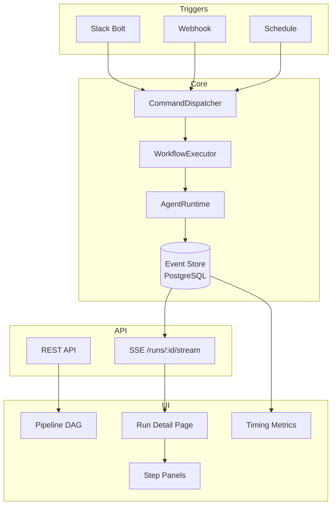
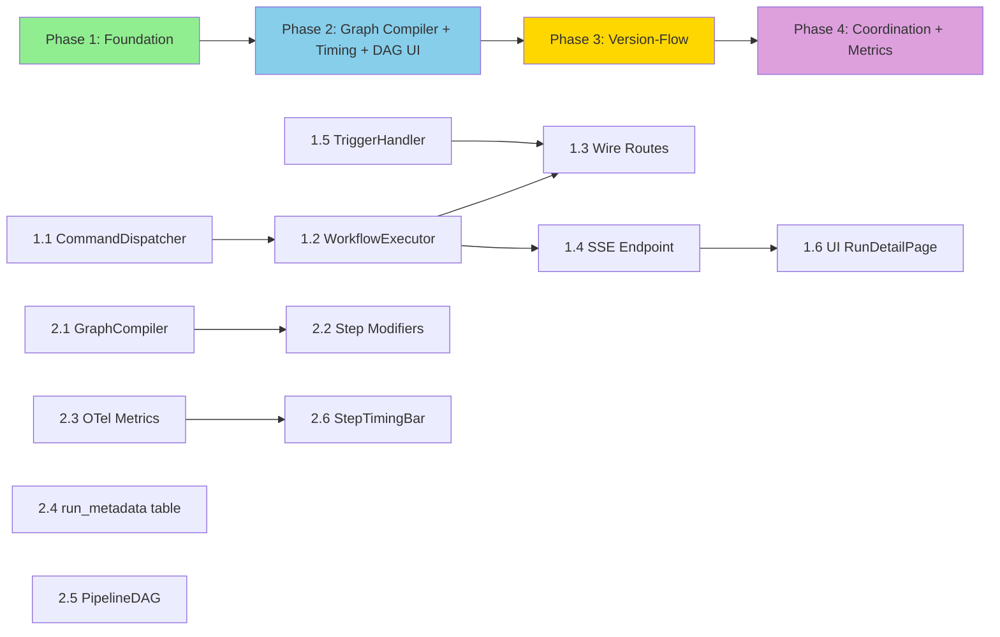

# Implementation Plan — Concourse-Inspired AI Scheduling (Option D: Hybrid)

**Selected Option:** D — Start minimal, evolve to Concourse-inspired primitives
**Tech Areas:** API (Python/FastAPI/LangGraph), UI (React/TypeScript)
**Worktree:** `../lintel-concourse-investigation` on branch `concourse-ci-investigation`

---

## Architecture Overview

```
┌─────────────────────────────────────────────────────────────────────┐
│                         Lintel Platform                             │
│                                                                     │
│  ┌──────────────┐    ┌──────────────────┐    ┌──────────────────┐  │
│  │  Triggers     │    │  Command          │    │  Workflow         │  │
│  │  ─────────    │    │  Dispatcher       │    │  Executor         │  │
│  │  Slack Bolt   │───▶│  ──────────────   │───▶│  ───────────────  │  │
│  │  Webhook      │    │  Routes commands  │    │  graph.astream()  │  │
│  │  Schedule     │    │  to handlers      │    │  + event emission │  │
│  └──────────────┘    └──────────────────┘    └────────┬─────────┘  │
│                                                        │            │
│                                                        ▼            │
│  ┌──────────────┐    ┌──────────────────┐    ┌──────────────────┐  │
│  │  SSE Stream   │◀───│  Event Store      │◀───│  Agent Runtime    │  │
│  │  /runs/:id/   │    │  (PostgreSQL)     │    │  LLM calls +     │  │
│  │  stream       │    │  Append-only      │    │  tool execution   │  │
│  └──────┬───────┘    └──────────────────┘    └──────────────────┘  │
│         │                                                           │
│         ▼                                                           │
│  ┌──────────────────────────────────────────────────────────────┐   │
│  │  React UI                                                     │   │
│  │  ┌─────────────┐  ┌──────────────┐  ┌─────────────────────┐ │   │
│  │  │ Pipeline DAG │  │ Run Detail   │  │ Step Panel          │ │   │
│  │  │ (React Flow) │  │ (SSE stream) │  │ (prompt/input/time) │ │   │
│  │  └─────────────┘  └──────────────┘  └─────────────────────┘ │   │
│  └──────────────────────────────────────────────────────────────┘   │
└─────────────────────────────────────────────────────────────────────┘
```



---

## SSE Event Schema

Inspired by Concourse's typed build events, extended for AI tool visibility:

```python
# src/lintel/contracts/stream_events.py

@dataclass(frozen=True)
class StreamEvent:
    """Base for all SSE events."""
    event_type: str
    step_id: str | None
    timestamp_ms: int

@dataclass(frozen=True)
class InitializeStep(StreamEvent):
    event_type: str = "initialize-step"
    step_type: str = ""        # "agent_step" | "approval_gate" | "tool_call"
    step_name: str = ""
    node_name: str = ""

@dataclass(frozen=True)
class StartStep(StreamEvent):
    event_type: str = "start-step"
    step_type: str = ""

@dataclass(frozen=True)
class FinishStep(StreamEvent):
    event_type: str = "finish-step"
    step_type: str = ""
    status: str = ""           # "succeeded" | "failed" | "errored"
    duration_ms: int = 0

@dataclass(frozen=True)
class ToolCall(StreamEvent):
    """AI tool invocation — Lintel extension beyond Concourse."""
    event_type: str = "tool-call"
    tool_name: str = ""        # "bash" | "docker" | "web_search" | ...
    model_id: str = ""
    prompt_preview: str = ""   # First ~500 chars of prompt/input
    tool_input_json: str = ""  # Full structured input
    input_tokens: int = 0

@dataclass(frozen=True)
class ToolResult(StreamEvent):
    event_type: str = "tool-result"
    tool_name: str = ""
    output_preview: str = ""
    output_tokens: int = 0
    latency_ms: int = 0
    exit_code: int | None = None

@dataclass(frozen=True)
class LogEvent(StreamEvent):
    event_type: str = "log"
    origin: str = ""           # step/node name
    payload: str = ""          # log text line

@dataclass(frozen=True)
class StatusEvent(StreamEvent):
    event_type: str = "status"
    step_id: str | None = None
    status: str = ""           # "started" | "succeeded" | "failed" | ...

@dataclass(frozen=True)
class EndEvent(StreamEvent):
    event_type: str = "end"
    step_id: str | None = None
```

---

## Phase 1: Foundation — Wire Command Bus, SSE Streaming, Basic Triggers

**Goal:** Make the existing workflow executable end-to-end. Stream output to the UI in real-time.

### Step 1.1: CommandDispatcher Protocol + Implementation

**File:** `src/lintel/contracts/protocols.py` (add to existing)

```python
class CommandDispatcher(Protocol):
    async def dispatch(self, command: Any) -> None: ...
```

**File:** `src/lintel/domain/command_dispatcher.py` (new)

```python
class InMemoryCommandDispatcher:
    def __init__(self) -> None:
        self._handlers: dict[type, Callable] = {}

    def register(self, command_type: type, handler: Callable) -> None:
        self._handlers[command_type] = handler

    async def dispatch(self, command: Any) -> None:
        handler = self._handlers.get(type(command))
        if handler is None:
            raise ValueError(f"No handler for {type(command).__name__}")
        await handler(command)
```

**Test:** `tests/unit/domain/test_command_dispatcher.py` — register handler, dispatch, verify called.

### Step 1.2: WorkflowExecutor — Wire StartWorkflow to LangGraph

**File:** `src/lintel/domain/workflow_executor.py` (new)

```python
class WorkflowExecutor:
    def __init__(
        self,
        event_store: EventStore,
        graph: CompiledStateGraph,
    ) -> None:
        self._event_store = event_store
        self._graph = graph

    async def execute(self, command: StartWorkflow) -> str:
        run_id = str(uuid4())
        thread_config = {"configurable": {"thread_id": run_id}}

        # Emit PipelineRunStarted
        await self._event_store.append(
            stream_id=f"run:{run_id}",
            events=[PipelineRunStarted(
                pipeline_id=command.workflow_type,
                run_id=run_id,
                trigger_type="slack",
                thread_ref=str(command.thread_ref),
            )],
        )

        # Stream execution, emitting events per step
        async for chunk in self._graph.astream(
            {"thread_ref": str(command.thread_ref), "correlation_id": run_id},
            config=thread_config,
            stream_mode=["updates", "messages"],
        ):
            # Emit step events to event store for SSE consumption
            await self._emit_step_events(run_id, chunk)

        # Emit PipelineRunCompleted
        await self._event_store.append(
            stream_id=f"run:{run_id}",
            events=[PipelineRunCompleted(run_id=run_id, status="succeeded")],
        )
        return run_id
```

**Test:** `tests/unit/domain/test_workflow_executor.py` — mock graph + event store, verify event emission.

### Step 1.3: Wire API Routes to Dispatcher

**File:** `src/lintel/api/routes/workflows.py` (modify existing)

Replace `return asdict(command)` with actual dispatch:

```python
@router.post("/workflows", status_code=201)
async def start_workflow(
    body: StartWorkflowRequest,
    dispatcher: CommandDispatcher = Depends(get_command_dispatcher),
) -> dict[str, Any]:
    thread_ref = ThreadRef(
        workspace_id=body.workspace_id,
        channel_id=body.channel_id,
        thread_ts=body.thread_ts,
    )
    command = StartWorkflow(thread_ref=thread_ref, workflow_type=body.workflow_type)
    run_id = await dispatcher.dispatch(command)
    return {"run_id": run_id, "status": "started"}
```

**Test:** `tests/unit/api/test_workflows.py` — verify dispatch called, run_id returned.

### Step 1.4: SSE Streaming Endpoint

**File:** `src/lintel/api/routes/streams.py` (new)

```python
from fastapi import APIRouter
from fastapi.responses import StreamingResponse

router = APIRouter(prefix="/api/v1", tags=["streams"])

@router.get("/runs/{run_id}/stream")
async def stream_run_events(
    run_id: str,
    event_store: EventStore = Depends(get_event_store),
) -> StreamingResponse:
    async def event_generator():
        stream_id = f"run:{run_id}"
        last_version = -1
        while True:
            events = await event_store.read_stream(stream_id, after_version=last_version)
            for envelope in events:
                sse_event = _to_sse_event(envelope)
                yield f"event: {sse_event.event_type}\ndata: {json.dumps(asdict(sse_event))}\n\n"
                last_version = envelope.stream_version
                if sse_event.event_type == "end":
                    return
            await asyncio.sleep(0.1)  # Poll interval

    return StreamingResponse(
        event_generator(),
        media_type="text/event-stream",
        headers={"Cache-Control": "no-cache", "X-Accel-Buffering": "no"},
    )
```

**Test:** `tests/integration/api/test_streams.py` — start workflow, connect SSE, verify events arrive.

### Step 1.5: Basic Trigger Handler

**File:** `src/lintel/domain/trigger_handler.py` (new)

```python
class TriggerHandler:
    def __init__(self, dispatcher: CommandDispatcher) -> None:
        self._dispatcher = dispatcher

    async def handle_slack_message(self, workspace_id: str, channel_id: str, thread_ts: str, workflow_type: str) -> str:
        command = StartWorkflow(
            thread_ref=ThreadRef(workspace_id=workspace_id, channel_id=channel_id, thread_ts=thread_ts),
            workflow_type=workflow_type,
        )
        return await self._dispatcher.dispatch(command)

    async def handle_webhook(self, pipeline_id: str, payload: dict) -> str:
        # Generate a synthetic thread ref for non-Slack triggers
        run_ref = f"webhook:{pipeline_id}:{uuid4().hex[:8]}"
        command = StartWorkflow(
            thread_ref=ThreadRef(workspace_id="system", channel_id=pipeline_id, thread_ts=run_ref),
            workflow_type=pipeline_id,
        )
        return await self._dispatcher.dispatch(command)
```

**Test:** `tests/unit/domain/test_trigger_handler.py` — verify Slack and webhook triggers dispatch commands.

### Step 1.6: UI — Run Detail Page with SSE Streaming

**File:** `ui/src/features/pipelines/hooks/useSSEStream.ts` (new)

```typescript
export function useSSEStream(runId: string | null) {
  const [events, setEvents] = useState<StreamEvent[]>([]);
  const [status, setStatus] = useState<'connecting' | 'streaming' | 'ended'>('connecting');

  useEffect(() => {
    if (!runId) return;
    const source = new EventSource(`/api/v1/runs/${runId}/stream`);

    const handleEvent = (e: MessageEvent) => {
      const event = JSON.parse(e.data) as StreamEvent;
      setEvents(prev => [...prev, event]);
      if (event.event_type === 'status') setStatus('streaming');
      if (event.event_type === 'end') {
        setStatus('ended');
        source.close();
      }
    };

    // Listen to all event types
    for (const type of ['initialize-step', 'start-step', 'finish-step',
      'tool-call', 'tool-result', 'log', 'status', 'end']) {
      source.addEventListener(type, handleEvent);
    }

    return () => source.close();
  }, [runId]);

  return { events, status };
}
```

**File:** `ui/src/features/pipelines/components/StepPanel.tsx` (new)

```typescript
// Collapsible panel per step (Concourse-style)
// - Header: step name, status icon (green/red/yellow), duration
// - Body: log lines with timestamps, tool-call/tool-result structured panels
// - Auto-expand on failure; auto-scroll to first error
```

**File:** `ui/src/features/pipelines/pages/RunDetailPage.tsx` (new)

```typescript
// Main run view page
// - Header: run ID, pipeline name, start time, status, total duration
// - Body: vertical list of StepPanels, one per step
// - SSE connection via useSSEStream hook
// - Step panels update in real-time as events arrive
```

**Validation:**
```bash
make test-unit   # All new unit tests pass
make test-integration   # SSE streaming integration test passes
make lint && make typecheck
```

---

## Phase 2: Graph Compiler, Timing Metrics, Pipeline DAG UI

**Goal:** Compile visual editor graphs into executable LangGraph. Add per-step timing. Build pipeline visualization.

**Blocked by:** Phase 1

### Step 2.1: GraphCompiler — Visual Editor → Executable StateGraph

**File:** `src/lintel/domain/graph_compiler.py` (new)

```python
class GraphCompiler:
    """Compiles stored {nodes, edges} from visual editor into executable StateGraph."""

    def __init__(self, node_registry: dict[str, Callable]) -> None:
        self._registry = node_registry  # Maps node type+role to async functions

    def compile(self, definition: WorkflowDefinition, checkpointer: BaseCheckpointSaver) -> CompiledStateGraph:
        graph = StateGraph(ThreadWorkflowState)

        for node in definition.graph["nodes"]:
            node_fn = self._resolve_node_function(node)
            graph.add_node(node["id"], node_fn)

        for edge in definition.graph["edges"]:
            graph.add_edge(edge["source"], edge["target"])

        # Set entry point from first node connected to START
        entry = self._find_entry_node(definition.graph)
        graph.set_entry_point(entry)

        # Find approval gates for interrupt_before
        approval_nodes = [n["id"] for n in definition.graph["nodes"] if n["type"] == "approvalGate"]

        return graph.compile(checkpointer=checkpointer, interrupt_before=approval_nodes)
```

**Test:** `tests/unit/domain/test_graph_compiler.py` — compile sample graph definition, verify topology.

### Step 2.2: Step Modifiers

**File:** `src/lintel/domain/step_modifiers.py` (new)

```python
def with_ensure(node_fn: Callable, cleanup_fn: Callable) -> Callable:
    """Concourse-style ensure: run cleanup_fn regardless of node_fn outcome."""
    async def wrapped(state: dict) -> dict:
        try:
            return await node_fn(state)
        finally:
            await cleanup_fn(state)
    return wrapped

def with_on_failure(node_fn: Callable, fallback_fn: Callable) -> Callable:
    """Concourse-style on_failure: run fallback_fn only if node_fn raises."""
    async def wrapped(state: dict) -> dict:
        try:
            return await node_fn(state)
        except Exception:
            return await fallback_fn(state)
    return wrapped

def with_try(node_fn: Callable) -> Callable:
    """Concourse-style try: suppress errors, continue pipeline."""
    async def wrapped(state: dict) -> dict:
        try:
            return await node_fn(state)
        except Exception:
            return state  # Return unchanged state
    return wrapped
```

**Test:** `tests/unit/domain/test_step_modifiers.py` — verify each modifier behavior.

### Step 2.3: Per-Step OTel Metrics

**File:** `src/lintel/infrastructure/observability/step_metrics.py` (new)

```python
from opentelemetry import metrics

meter = metrics.get_meter("lintel.steps")

step_duration_histogram = meter.create_histogram(
    name="lintel_step_duration_seconds",
    description="Duration of each workflow step execution",
    unit="s",
)

step_tokens_counter = meter.create_counter(
    name="lintel_step_tokens_total",
    description="Tokens consumed per step",
    unit="tokens",
)

def record_step_duration(
    workflow_id: str, step_type: str, tool_name: str, status: str, duration_s: float
) -> None:
    step_duration_histogram.record(
        duration_s,
        attributes={
            "workflow_id": workflow_id,
            "step_type": step_type,
            "tool_name": tool_name,
            "status": status,
        },
    )
```

**Test:** `tests/unit/infrastructure/test_step_metrics.py` — verify histogram recording with correct attributes.

### Step 2.4: Run Metadata Table

**Migration:** Add `run_metadata` table for fast run queries without scanning event streams.

```sql
CREATE TABLE IF NOT EXISTS run_metadata (
    run_id TEXT PRIMARY KEY,
    pipeline_id TEXT NOT NULL,
    status TEXT NOT NULL DEFAULT 'pending',
    trigger_type TEXT NOT NULL,
    started_at TIMESTAMPTZ,
    finished_at TIMESTAMPTZ,
    duration_ms BIGINT,
    step_count INTEGER DEFAULT 0,
    thread_ref TEXT,
    created_at TIMESTAMPTZ NOT NULL DEFAULT NOW()
);

CREATE INDEX idx_run_metadata_pipeline ON run_metadata(pipeline_id, created_at DESC);
CREATE INDEX idx_run_metadata_status ON run_metadata(status);
```

### Step 2.5: UI — Pipeline DAG Visualization

**File:** `ui/src/features/pipelines/components/PipelineDAG.tsx` (new)

```typescript
// React Flow-based pipeline DAG (extends existing WorkflowEditorPage pattern)
// Read-only view mode (editor mode already exists)
// Node types: agentStep (blue), approvalGate (yellow), toolCall (grey)
// Edge styles: solid = sequential, animated = currently executing
// Color coding: green = succeeded, red = failed, yellow halo = running, grey = pending
// Click node → navigate to RunDetailPage filtered to that step
```

**File:** `ui/src/features/pipelines/pages/PipelineDetailPage.tsx` (new)

```typescript
// Pipeline detail view
// Header: pipeline name, last run status, trigger controls
// Body: PipelineDAG component showing latest run state
// Sidebar: run history list (click to switch displayed run)
```

### Step 2.6: UI — Step Timing Display

**File:** `ui/src/features/pipelines/components/StepTimingBar.tsx` (new)

```typescript
// Horizontal bar chart showing duration per step (Gantt-style)
// Color by step type: agent=blue, tool=grey, approval=yellow
// Hover: shows exact start/end timestamps, token counts
// Sorted by execution order (top to bottom)
// Total duration shown at bottom
```

**Validation:**
```bash
make test-unit
make test-integration
make lint && make typecheck
```

---

## Phase 3: Version-Flow Model and Multi-Stage Pipelines

**Goal:** Add Concourse's most powerful abstraction — version-flow with `passed` constraints.

**Blocked by:** Phase 2

### Step 3.1: Resource Version Domain Types

**File:** `src/lintel/contracts/types.py` (extend existing)

```python
@dataclass(frozen=True)
class ResourceVersion:
    resource_name: str
    version: dict[str, str]  # Concourse-style string-only values
    metadata: list[dict[str, str]] = field(default_factory=list)

@dataclass(frozen=True)
class PassedConstraint:
    resource_name: str
    jobs: list[str]  # Upstream jobs that must have processed this version
```

**File:** `src/lintel/contracts/events.py` (extend existing)

```python
@dataclass(frozen=True)
class ResourceVersionProduced(EventEnvelope):
    event_type: str = "resource_version_produced"
    resource_name: str = ""
    version: dict[str, str] = field(default_factory=dict)
    producing_job: str = ""
    run_id: str = ""

@dataclass(frozen=True)
class ResourceVersionConsumed(EventEnvelope):
    event_type: str = "resource_version_consumed"
    resource_name: str = ""
    version: dict[str, str] = field(default_factory=dict)
    consuming_job: str = ""
    run_id: str = ""
```

### Step 3.2: Version Resolver

**File:** `src/lintel/domain/version_resolver.py` (new)

```python
class VersionResolver:
    """Implements Concourse's version resolution algorithm (simplified for single-node)."""

    def __init__(self, event_store: EventStore) -> None:
        self._event_store = event_store

    async def resolve(
        self, job_name: str, inputs: list[JobInput]
    ) -> dict[str, ResourceVersion] | None:
        """Returns resolved version set or None if no new triggerable versions."""
        resolved = {}
        for inp in inputs:
            if inp.passed_constraints:
                version = await self._resolve_with_passed(inp)
            else:
                version = await self._resolve_latest(inp.resource_name)
            if version is None:
                return None
            resolved[inp.resource_name] = version
        return resolved
```

### Step 3.3: Pipeline Scheduler

**File:** `src/lintel/domain/pipeline_scheduler.py` (new)

```python
class PipelineScheduler:
    """Checks for new resource versions and schedules downstream jobs."""

    def __init__(
        self,
        event_store: EventStore,
        version_resolver: VersionResolver,
        dispatcher: CommandDispatcher,
    ) -> None:
        self._event_store = event_store
        self._resolver = version_resolver
        self._dispatcher = dispatcher

    async def tick(self) -> list[str]:
        """One scheduling tick — check all pipelines for schedulable jobs."""
        scheduled_runs = []
        pipelines = await self._load_active_pipelines()
        for pipeline in pipelines:
            for job in pipeline.jobs:
                versions = await self._resolver.resolve(job.name, job.inputs)
                if versions and self._has_new_trigger_version(job, versions):
                    run_id = await self._schedule_job(pipeline, job, versions)
                    scheduled_runs.append(run_id)
        return scheduled_runs
```

### Step 3.4: UI — Multi-Stage Pipeline Visualization

Extend `PipelineDAG` to show:
- Resource nodes between jobs (Concourse-style rounded rectangles)
- Version badges on resource nodes showing current version
- `passed` constraint edges (solid vs dotted for trigger/no-trigger)
- Version lineage: click resource → see version history and which jobs consumed each version

**Validation:**
```bash
make test-unit
make test-integration
make lint && make typecheck
```

---

## Phase 4: Coordination and Metrics Dashboard

**Goal:** Add PostgreSQL advisory locks for eventual multi-node. Build metrics dashboard.

**Blocked by:** Phase 3

### Step 4.1: PostgreSQL Advisory Lock Coordinator

**File:** `src/lintel/infrastructure/coordination/advisory_lock.py` (new)

```python
class AdvisoryLockCoordinator:
    """PostgreSQL advisory locks for single-scheduler-per-tick coordination."""

    SCHEDULER_LOCK_ID = 42424242  # Arbitrary but stable

    def __init__(self, pool: asyncpg.Pool) -> None:
        self._pool = pool

    async def try_acquire_scheduler_lock(self) -> bool:
        """Non-blocking attempt to acquire the scheduler advisory lock."""
        async with self._pool.acquire() as conn:
            return await conn.fetchval(
                "SELECT pg_try_advisory_lock($1)", self.SCHEDULER_LOCK_ID
            )

    async def release_scheduler_lock(self) -> None:
        async with self._pool.acquire() as conn:
            await conn.execute(
                "SELECT pg_advisory_unlock($1)", self.SCHEDULER_LOCK_ID
            )
```

### Step 4.2: Scheduler Loop

**File:** `src/lintel/domain/scheduler_loop.py` (new)

```python
class SchedulerLoop:
    """Background task running the pipeline scheduler on a fixed interval."""

    TICK_INTERVAL_SECONDS = 10  # Match Concourse's default

    def __init__(
        self,
        coordinator: AdvisoryLockCoordinator,
        scheduler: PipelineScheduler,
    ) -> None:
        self._coordinator = coordinator
        self._scheduler = scheduler

    async def run(self) -> None:
        while True:
            if await self._coordinator.try_acquire_scheduler_lock():
                try:
                    await self._scheduler.tick()
                finally:
                    await self._coordinator.release_scheduler_lock()
            await asyncio.sleep(self.TICK_INTERVAL_SECONDS)
```

### Step 4.3: UI — Metrics Dashboard

**File:** `ui/src/features/pipelines/pages/MetricsDashboardPage.tsx` (new)

```typescript
// Dashboard showing:
// 1. Step duration histogram (bar chart) — grouped by step_type, filterable by pipeline
// 2. Run duration trend (line chart) — P50/P95/P99 over time
// 3. Token usage breakdown (pie chart) — per model, per agent role
// 4. Slowest steps table — sortable, with drill-down to specific runs
// 5. Active runs (live) — currently executing with progress indicators
// Data source: /api/v1/metrics endpoint querying run_metadata + event store
```

**Validation:**
```bash
make all  # lint + typecheck + test
```

---

## Dependency Graph



**Parallel execution within phases:**
- Phase 1: Steps 1.1-1.3 (backend) can run parallel to 1.4-1.6 (SSE + UI) after 1.2
- Phase 2: Steps 2.1-2.2 (compiler) can run parallel to 2.3-2.4 (metrics) and 2.5-2.6 (UI)

---

## Test Strategy

### Phase 1 Tests
- **Unit:** CommandDispatcher registration + dispatch, WorkflowExecutor event emission (mock graph), TriggerHandler command creation
- **Integration:** SSE endpoint end-to-end with event store, workflow start → events → SSE stream
- **E2E:** Start workflow via API → verify SSE stream delivers typed events → UI renders step panels

### Phase 2 Tests
- **Unit:** GraphCompiler topology validation, step modifier behavior, OTel metric recording
- **Integration:** Compile stored graph → execute → verify step events with timing
- **E2E:** Visual editor save → compile → execute → DAG shows live status → timing bars update

### Phase 3 Tests
- **Unit:** VersionResolver individual/group/pinned resolution, PipelineScheduler tick logic
- **Integration:** Produce version → scheduler detects → dispatches downstream job
- **E2E:** Multi-stage pipeline with passed constraints runs end-to-end

### Phase 4 Tests
- **Unit:** Advisory lock acquire/release
- **Integration:** Two concurrent schedulers → only one acquires lock per tick
- **E2E:** Metrics dashboard shows accurate timing data from completed runs

---

## New Files Summary

### Phase 1
| File | Type | Description |
|------|------|-------------|
| `src/lintel/domain/command_dispatcher.py` | New | Command bus protocol + in-memory impl |
| `src/lintel/domain/workflow_executor.py` | New | Wires StartWorkflow → graph.astream() |
| `src/lintel/domain/trigger_handler.py` | New | Maps triggers to StartWorkflow commands |
| `src/lintel/api/routes/streams.py` | New | SSE endpoint for run event streaming |
| `src/lintel/contracts/stream_events.py` | New | Typed SSE event dataclasses |
| `ui/src/features/pipelines/hooks/useSSEStream.ts` | New | React hook for SSE consumption |
| `ui/src/features/pipelines/components/StepPanel.tsx` | New | Collapsible step panel with logs/tools |
| `ui/src/features/pipelines/pages/RunDetailPage.tsx` | New | Run detail page with live streaming |

### Phase 2
| File | Type | Description |
|------|------|-------------|
| `src/lintel/domain/graph_compiler.py` | New | Visual editor → StateGraph compiler |
| `src/lintel/domain/step_modifiers.py` | New | ensure/on_failure/try wrappers |
| `src/lintel/infrastructure/observability/step_metrics.py` | New | Per-step OTel histograms |
| `ui/src/features/pipelines/components/PipelineDAG.tsx` | New | React Flow pipeline visualization |
| `ui/src/features/pipelines/pages/PipelineDetailPage.tsx` | New | Pipeline detail with DAG + history |
| `ui/src/features/pipelines/components/StepTimingBar.tsx` | New | Gantt-style step timing chart |

### Phase 3
| File | Type | Description |
|------|------|-------------|
| `src/lintel/domain/version_resolver.py` | New | Concourse-style version resolution |
| `src/lintel/domain/pipeline_scheduler.py` | New | Trigger-on-new-version scheduler |

### Phase 4
| File | Type | Description |
|------|------|-------------|
| `src/lintel/infrastructure/coordination/advisory_lock.py` | New | PostgreSQL advisory lock coordinator |
| `src/lintel/domain/scheduler_loop.py` | New | Background scheduler tick loop |
| `ui/src/features/pipelines/pages/MetricsDashboardPage.tsx` | New | Timing metrics dashboard |

### Modified Files
| File | Phase | Change |
|------|-------|--------|
| `src/lintel/contracts/protocols.py` | 1 | Add CommandDispatcher protocol |
| `src/lintel/api/routes/workflows.py` | 1 | Wire to dispatcher instead of returning asdict |
| `src/lintel/contracts/types.py` | 3 | Add ResourceVersion, PassedConstraint |
| `src/lintel/contracts/events.py` | 3 | Add ResourceVersionProduced/Consumed |
