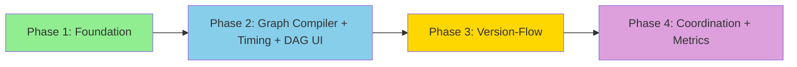

# Implementation Checklist

Track implementation progress by checking off completed items.

## Dependency Overview

---

## Phase 1: Foundation — Wire Command Bus, SSE Streaming, Basic Triggers

- [ ] Step 1.1: CommandDispatcher protocol + InMemoryCommandDispatcher
- [ ] Step 1.2: WorkflowExecutor — wire StartWorkflow to graph.astream() with event emission
- [ ] Step 1.3: Wire API routes to dispatcher (replace `return asdict(command)`)
- [ ] Step 1.4: SSE streaming endpoint (`GET /runs/{id}/stream`)
- [ ] Step 1.5: TriggerHandler — map Slack/webhook events to StartWorkflow commands
- [ ] Step 1.6: UI — RunDetailPage with useSSEStream hook and StepPanel components
- [ ] Validation: `make test-unit && make test-integration && make lint && make typecheck`

## Phase 2: Graph Compiler, Timing Metrics, Pipeline DAG UI

- [ ] Step 2.1: GraphCompiler — visual editor `{nodes, edges}` → executable StateGraph
  - Blocked by: Phase 1
- [ ] Step 2.2: Step modifiers — with_ensure(), with_on_failure(), with_try()
- [ ] Step 2.3: Per-step OTel metrics — lintel_step_duration_seconds histogram
- [ ] Step 2.4: run_metadata table migration
- [ ] Step 2.5: UI — PipelineDAG component (React Flow read-only view) + PipelineDetailPage
- [ ] Step 2.6: UI — StepTimingBar component (Gantt-style per-step duration)
- [ ] Validation: `make test-unit && make test-integration && make lint && make typecheck`

## Phase 3: Version-Flow Model and Multi-Stage Pipelines

- [ ] Step 3.1: ResourceVersion + PassedConstraint domain types + events
  - Blocked by: Phase 2
- [ ] Step 3.2: VersionResolver — individual/group resolution algorithm
- [ ] Step 3.3: PipelineScheduler — trigger-on-new-version scheduler
- [ ] Step 3.4: UI — Multi-stage pipeline visualization with version-flow edges
- [ ] Validation: `make test-unit && make test-integration && make lint && make typecheck`

## Phase 4: Coordination and Metrics Dashboard

- [ ] Step 4.1: PostgreSQL advisory lock coordinator
  - Blocked by: Phase 3
- [ ] Step 4.2: Scheduler loop with lock acquisition (10s tick interval)
- [ ] Step 4.3: UI — Metrics dashboard (step duration charts, token usage, slowest steps)
- [ ] Validation: `make all`

---

## Final Verification

- [ ] All tests pass (`make all`)
- [ ] SSE streaming works end-to-end (trigger → events → UI)
- [ ] Pipeline DAG renders with live status updates
- [ ] Per-step timing visible in UI and exposed as Prometheus metrics
- [ ] Tool call prompt/input visible in step panels

---

## Notes

- All work in worktree: `../lintel-concourse-investigation` on branch `concourse-ci-investigation`
- Within phases, backend and UI steps can run in parallel
- Phase 1 is the critical path — unblocks everything else
